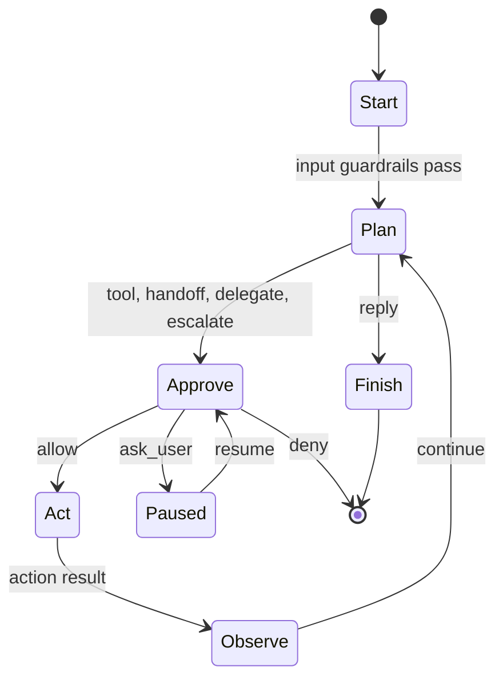

# Agent OS Design

Agent OS is built around one typed run loop. The loop owns all transitions between planning, approval, action, observation, pause, and finish states. Extensions can implement public interfaces, but the core engine owns the safety-critical control flow.

This document is the condensed loop-and-safety reference. See
[`docs/ARCHITECTURE.md`](docs/ARCHITECTURE.md) for the full architecture, memory
model, and extension boundary. During audit remediation,
[`ADR-001`](docs/adr/ADR-001-remediation-contracts.md) is authoritative for
policy narrowing, isolation, principal identity, provider requests, safety
events, clear semantics, and output delivery. The current support level of each
feature is listed in the [`capability matrix`](docs/CAPABILITY_MATRIX.md).

## Layering

```text
extensions/      Optional implementations of public interfaces.
workspace/       Agent-owned configuration, memory, tools, and skills.
crates/          Immutable runtime core and public APIs.
```

`agentos-core` must not depend on `workspace/` or `extensions/`. Types that need to cross this boundary belong in `agentos-interfaces` or `agentos-proto`. Workspace-owned content is loaded as data through config, never linked as a dependency. The boundary is enforced by `scripts/check-import-boundaries.sh`.

## Run Loop



`RunLoopState::step()` consumes the current state and returns the next state. The state enum is `Start`, `Plan`, `Approve`, `Act`, `Observe`, `Paused`, `Finish`. Invalid transitions are not represented by the public API.

Plan variants:

- `Reply`: terminal assistant output.
- `CallTool`: execute a local or MCP-backed tool.
- `CallTools`: a batch of calls the model asked for in one response. The batch is
  queued on the run state and drained one call per turn, so each crosses
  `Approve` on its own and results append in the order asked for. No new state,
  no new transition.
- `Handoff`: switch the active agent and continue planning.
- `Delegate`: run a sub-agent and return its result to the parent.
- `Escalate`: run a configured sub-orchestrator template.

Guardrail and approval placement:

- Input guardrails run in `Start`; tool guardrails run in `Act`; output guardrails run before a terminal reply finishes.
- Every non-terminal action crosses `Approve`. `allow` proceeds to `Act`, `deny` terminates with a policy error, and `ask_user` serializes a paused `RunState` for later resume.
- Sub-agent permissions are checked per action and argument constraint. Parent
  `AskUser` cannot become child `Allow`, and a child cannot drop a parent
  constraint; every sub-agent tool call re-enters the loop at `Approve`.
- An approval prompt issues a ticket, and only an answer naming that ticket decides it. Anything else stays ordinary input.
- `Plan` is also where input that arrived mid-run is claimed: the previous turn has been observed and the next request has not been assembled yet.

## The request

One module, `crates/agentos-core/src/prompt/`, is the only path from a run's context to the messages a provider sees. Every contribution is a named section, and every call returns a manifest recorded in the trace, so "what did the model see" is answered from the trace rather than by re-reading the code.

The session log beneath it is append-only. What the model sees is a *projection* over that log: a checkpoint item summarizes an inclusive range of earlier positions and the projection folds that range out. Compaction, tool-output elision, and conversation fork are therefore all reads, never rewrites — which is what keeps the record of what actually happened intact while what the model reads shrinks.

Pressure is estimated per request, relieved first by eliding already-spilled tool output and then, if that is not enough, by summarizing the oldest span. A provider that rejects a request for length is the one trigger that is never an estimate: the loop forces one compaction and retries once.

## Gateway

The gateway has three layers. `Gateway` remains a bounded `mpsc` ingress queue for cron tasks and other producers that already have an `Envelope`. `GatewayService` sits above that queue and drives channel-facing work: receive an inbound envelope from a `Channel`, run it through the runner, send the final reply back through the same channel, and send approval prompts for paused runs.

Above both, conversations are actors. Each has a bounded `Inbox` and is assigned by stable hash to one of `[gateway].shards` OS threads, each running its own `current_thread` runtime, so one conversation waiting on a slow tool does not stall any other. Within a conversation everything stays strictly serial — two concurrent runs would both load the transcript and the second write-back would clobber the first. The run-loop future is `!Send` (sub-agent execution drives a `LocalSet`), so thread-per-core is the scaling model, adopted deliberately rather than by omission.

## Safety Rings

1. Type system: `RunLoopState`, `Plan`, and `PolicyDecision` encode state and action choices explicitly.
2. Guardrails: input, tool, and output checks inspect content and halt with typed errors.
3. Approve: every boundary action receives an allow, deny, or ask-user decision from the concrete policy engine. `Approve` is concrete, not an extension trait.
4. Isolation: a tool declares a `SandboxMode` — `read_only`, `workspace_write`, or `full_access`. Anything but `full_access` requires an executor whose advertised modes and versioned tool protocol match the call; the registry checks that compatibility before invoking the tool body. The child process's filesystem writes are then refused by the kernel: Landlock on Linux, Seatbelt on macOS, inherited by every descendant. A missing executor, unavailable backend, unsupported protocol or mode, and worker failure are typed refusals with no in-process fallback. `full_access` means no sandbox, which is what a tool that does its work in-process declares — the only restriction available to those would apply to the whole agent, permanently, so they are bounded by rings 2 and 3 instead. Reads are not restricted, and neither is the network. `agentos-gateway config` prints which mechanism (if any) this machine enforces with.

### Checked invariants

Three relationships the rings depend on are asserted in debug builds
(`crates/agentos-core/src/invariants.rs`): every provider message derives from
`RunState` and is accounted for in the manifest that claims to describe the
request; every delegation's effective policy reaches no action its parent
cannot; and every tool result in the transcript follows an assistant item
carrying its call id.

These are **not a fifth ring**. They are compiled out of release builds
entirely, so they protect development rather than deployment — a violation is a
bug in the core, not a state a deployment can reach by configuration. Each
states a relationship between two pieces of authoritative state rather than
re-running the code it checks, and each has a test that violates it and observes
the panic.

## Status

The typed loop and its supporting features are implemented, but implementation
presence is not a release-support claim. The 2026-08-18 audit found contract
gaps in identity, authorization, isolation, request auditability, configuration,
streaming, and distribution. The [`capability
matrix`](docs/CAPABILITY_MATRIX.md) is the authority for Stable, Preview, and
Deferred status. Remediation sequencing lives in
[`docs/AUDIT_REMEDIATION_PLAN.md`](docs/AUDIT_REMEDIATION_PLAN.md).
