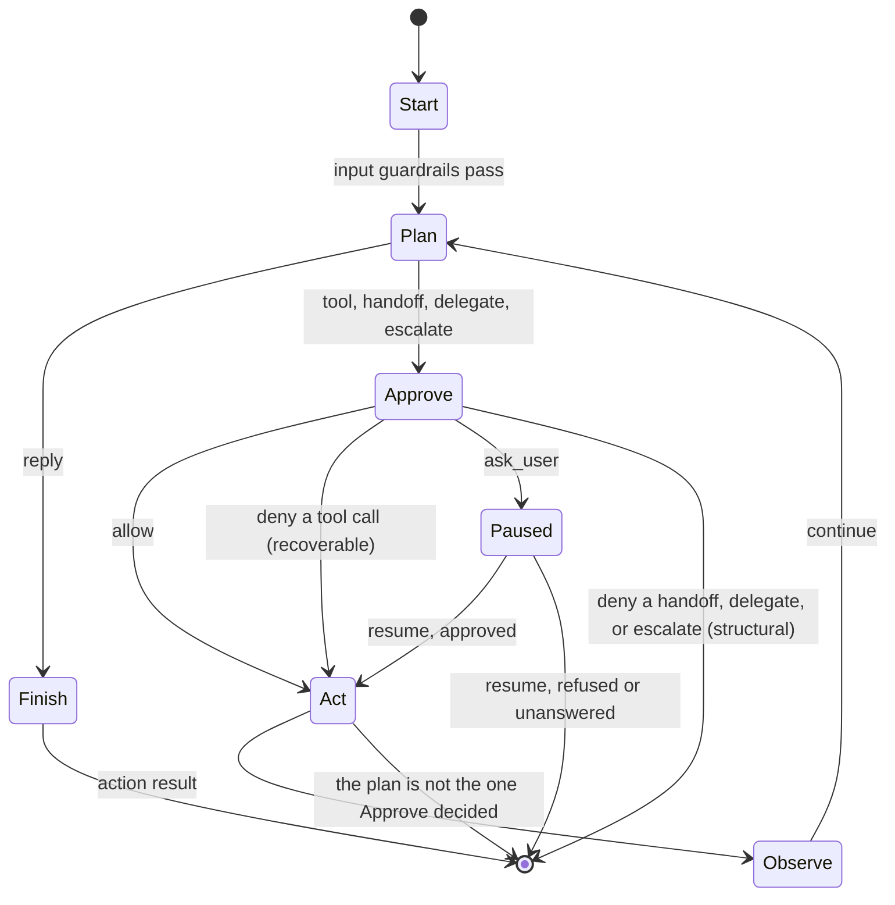

# Agent OS Design

Agent OS is built around one typed run loop. The loop owns all transitions between planning, approval, action, observation, pause, and finish states. Extensions can implement public interfaces, but the core engine owns the safety-critical control flow.

This document is the condensed loop-and-safety reference. See [`docs/ARCHITECTURE.md`](docs/ARCHITECTURE.md) for the full architecture, memory model, and extension boundary.

## Layering

```text
extensions/      Optional implementations of public interfaces.
workspace/       Agent-owned configuration, memory, tools, and skills.
crates/          Immutable runtime core and public APIs.
```

`agentos-core` must not depend on `workspace/` or `extensions/`. Types that need to cross this boundary belong in `agentos-interfaces` or `agentos-proto`. Workspace-owned content is loaded as data through config, never linked as a dependency. The boundary is enforced by `scripts/check-import-boundaries.sh`.

## Run Loop



`RunLoopState::step()` consumes the current state and returns the next state. The state enum is `Start`, `Plan`, `Approve`, `Act`, `Observe`, `Paused`, `Finish`. A step that fails returns a `StepFailure` carrying the state back out, so a run that ends badly still persists its trace.

Two denials, and they are different kinds of thing. A policy `deny` on a **tool call** is *recoverable*: `Act` records a `Denied` `ToolResult` instead of running the tool, the model reads the refusal on the next turn and replans, and the run continues. It never becomes a `RunError`. A policy `deny` on a **handoff, delegation, or escalation** is *structural*: there is no tool-call id to attach a result to and nothing for the model to retry around, so the run ends with `RunError::StructuralDenial`. That is again distinct from `RunError::ApprovalDenied`, which means a human was asked and said no.

The ordering is enforced, not just documented. `ActCtx` carries a private `Authorization` with no public constructor, so a caller cannot build one and skip `Approve`; the witness names the plan it was issued for, so a caller holding a real `ActCtx` cannot assign a different plan over the approved one; and `Act` re-decides against the live policy before running anything, accepting `ask_user` only when a human actually answered. `crates/agentos-core/tests/loop_transitions.rs` pins the table, so a new edge has to be added there before it can be added to the loop.

Plan variants:

- `Reply`: terminal assistant output.
- `CallTool`: execute a local or MCP-backed tool.
- `CallTools`: a batch of calls the model asked for in one response. The batch is
  queued on the run state and drained one call per turn, so each crosses
  `Approve` on its own and results append in the order asked for. No new state,
  no new transition.
- `Handoff`: switch the active agent and continue planning.
- `Delegate`: run a sub-agent and return its result to the parent.
- `Escalate`: run a configured sub-orchestrator template.

Guardrail and approval placement:

- Input guardrails run in `Start`; tool guardrails run in `Act`; output guardrails run before a terminal reply finishes — the loop's own cancellation and budget notices included, which pass through `loop/output.rs` and are replaced by a shorter fixed notice if the policy refuses them. Streaming forwards chunks before that check can run, so it is off unless `[channels] provisional_streaming` turns it on.
- Every non-terminal action crosses `Approve`, and `Act` re-asserts that it did. `allow` proceeds to `Act`, `deny` either records a refusal the model can replan around (a tool call) or terminates the run (anything structural), and `ask_user` serializes a paused `RunState` for later resume.
- Sub-agent permissions can only narrow the parent's, over actions and arguments alike; every sub-agent tool call re-enters the loop at `Approve`. A sub-agent that needs more than its parent holds carries an explicit delegation grant naming the tool and the reason.
- An approval prompt issues a ticket, and only an answer naming that ticket decides it. Anything else stays ordinary input.
- `Plan` is also where input that arrived mid-run is claimed: the previous turn has been observed and the next request has not been assembled yet.

## The request

One module, `crates/agentos-core/src/prompt/`, is the only path from a run's context to the messages a provider sees. Every contribution is a named section, and every call returns a manifest recorded in the trace, so "what did the model see" is answered from the trace rather than by re-reading the code.

The session log beneath it is append-only. What the model sees is a *projection* over that log: a checkpoint item summarizes an inclusive range of earlier positions and the projection folds that range out. Compaction, tool-output elision, and conversation fork are therefore all reads, never rewrites — which is what keeps the record of what actually happened intact while what the model reads shrinks. `/clear` is the same mechanism applied to the whole history rather than to a span: it appends an epoch marker and removes nothing, so the model starts fresh while the log still holds what happened. Irreversible removal is a separate operator command, `agentos-gateway purge`, which names the conversation twice and records a safety event — because somebody asking to be forgotten is a legitimate requirement, and it is simply not what `/clear` means.

Pressure is estimated per request, relieved first by eliding already-spilled tool output and then, if that is not enough, by summarizing the oldest span. A provider that rejects a request for length is the one trigger that is never an estimate: the loop forces one compaction and retries once.

## Gateway

The gateway has three layers. `Gateway` remains a bounded `mpsc` ingress queue for cron tasks and other producers that already have an `Envelope`. `GatewayService` sits above that queue and drives channel-facing work: receive an inbound envelope from a `Channel`, run it through the runner, send the final reply back through the same channel, and send approval prompts for paused runs.

Above both, conversations are actors. Each has a bounded `Inbox` and is assigned by stable hash to one of `[gateway].shards` OS threads, each running its own `current_thread` runtime, so one conversation waiting on a slow tool does not stall any other. Within a conversation everything stays strictly serial — two concurrent runs would both load the transcript and the second write-back would clobber the first. The run-loop future is `!Send` (sub-agent execution drives a `LocalSet`), so thread-per-core is the scaling model, adopted deliberately rather than by omission.

## Safety Rings

1. Type system: `RunLoopState`, `Plan`, and `PolicyDecision` encode state and action choices explicitly.
2. Guardrails: input, tool, and output checks inspect content and halt with typed errors.
3. Approve: every boundary action receives an allow, deny, or ask-user decision from the concrete policy engine. `Approve` is concrete, not an extension trait.
4. Isolation: a tool declares a `SandboxMode` — `read_only`, `workspace_write`, or `full_access`. Anything but `full_access` runs the tool in a child process whose filesystem writes the kernel refuses: Landlock on Linux, Seatbelt on macOS, and the restriction is inherited by every descendant. `full_access` means no sandbox, which is what a tool that does its work in-process declares — the only restriction available to those would apply to the whole agent, permanently, so they are bounded by rings 2 and 3 instead. Reads are not restricted, and neither is the network. Where no backend exists, a sandboxed tool fails rather than running unsandboxed, and `agentos-gateway config` prints which mechanism (if any) this machine enforces with. Two things can carry the mode: an isolated executor the registry dispatches to, whose `--capabilities` handshake reports what it can actually run and enforce, or the tool's own hardening of its own child (`Isolation::SelfHardened`, which only `shell` claims). A tool that declares a mode and provides neither is refused at startup and at every call.

Rings 5 through 9 are stated in full in
[`docs/ARCHITECTURE.md` §10](docs/ARCHITECTURE.md): filesystem containment
(`openat(O_NOFOLLOW)`, directory-relative, symlinks refused rather than
resolved), subprocess environment and lifetime (`env_clear` plus a named
allowlist, one process group per child), tool egress (decided on the resolved
address inside the DNS resolver, bodies bounded, ambient proxy off), bounded
ingress (nothing off the wire sizes an allocation), and durable safety events
(every decision above appends an append-only, redacted row; deletion is never
the record of an outcome).

### Checked invariants

Three relationships the rings depend on are asserted in debug builds
(`crates/agentos-core/src/invariants.rs`): every provider message derives from
`RunState` and is accounted for in the manifest that claims to describe the
request; every delegation's effective policy reaches no action its parent
cannot; and every tool result in the transcript follows an assistant item
carrying its call id.

These are **not a ring of their own**. They are compiled out of release builds
entirely, so they protect development rather than deployment — a violation is a
bug in the core, not a state a deployment can reach by configuration. Each
states a relationship between two pieces of authoritative state rather than
re-running the code it checks, and each has a test that violates it and observes
the panic.

## Status

The scaffold milestone is complete. The active baseline includes the typed loop and trace shape; concrete approval with serializable paused runs and ticket-correlated prompts; one prompt-assembly authority with projection, spill, elision, compaction, and overflow recovery; reference tools and guardrails with per-call deadlines and background-job promotion; run cancellation and mid-run steering; per-conversation actors sharded across threads; SQLite session and scoped memory storage with hydration and reflection; streaming across three providers and both chat channels; Telegram and Feishu reference channels; configured sub-agents and sub-orchestrator templates; static and stdio MCP registration; kernel-sandboxed subprocess execution for tools that declare a mode; and runtime path injection with an enforced extension boundary.

Remaining architecture work and open decisions are tracked in [`docs/ARCHITECTURE.md`](docs/ARCHITECTURE.md); current sequencing is [`docs/TRANSFER_ROADMAP.md`](docs/TRANSFER_ROADMAP.md).
