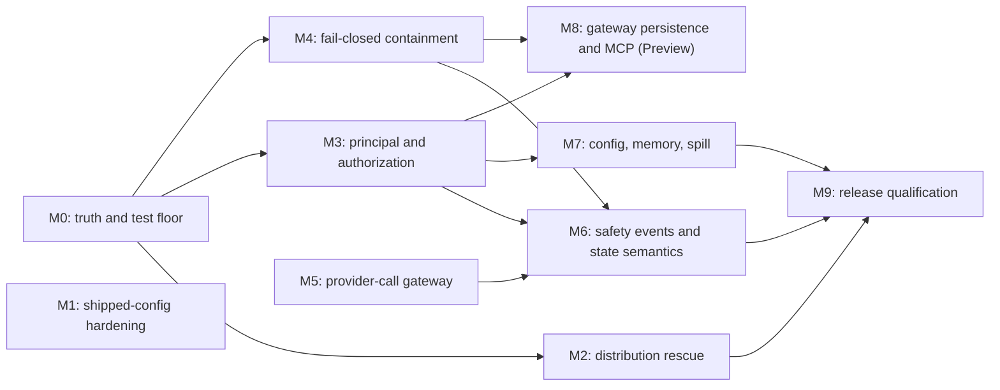

# AgentOS Audit Remediation Plan

Status: active
Created: 2026-08-18
Rewritten: 2026-08-19
Planning baseline: `main` at `224f070`
Source: architecture, feature-completeness, security, operability, and
verification audit completed on 2026-08-18

> This document supersedes the copy previously kept outside the repository at
> `/workspace/backup/AUDIT_REMEDIATION_PLAN.md`. That copy marked roughly ten
> work slices "implemented and locally verified" that do not exist in this tree,
> and linked two files that were never written. Every status below has been
> reset to what the code actually shows. See
> [How this plan was validated](#2-how-this-plan-was-validated).

## 1. Purpose

This plan converts the 2026-08-18 audit into executable development work. It
supersedes the completion claims in the older roadmaps wherever the audit found
that a documented invariant, stable feature, or release contract is not enforced
end to end.

The objective is not to add more surface area. It is to make the current surface
truthful, fail-closed, testable, and releasable.

**The status column is evidence, not intent.** A slice moves off `not started`
only when a named test demonstrates closure. Code presence is not enough, and
neither is a plan entry.

## 2. How this plan was validated

Every status claim below was checked against `main` at `224f070` by reading the
implicated module. The checks are cheap; re-run them rather than trusting the
table.

```sh
cd /workspace/agentos
git log --oneline -3                                            # HEAD 224f070, tree clean
grep -rn "PrincipalKeyV1\|SenderIdentity\|SessionKey" crates/    # zero hits
ls docs/adr                                                      # written by ADR-001
sed -n '38,52p'   scripts/package-release.sh                     # one workspace file shipped
sed -n '5,7p'     scripts/install-agentos.sh                     # ~/.agentos, not ~/.local
sed -n '148,207p' crates/agentos-core/src/approve/mod.rs         # parent_exposes_tool
sed -n '152,170p' crates/agentos-core/src/tools/registry.rs      # if-let with no else
sed -n '80,111p'  crates/agentos-core/src/guardrails/mod.rs      # program name only
sed -n '145,152p' crates/agentos-core/src/memory/sqlite.rs       # DELETE on /clear
sed -n '170,178p' crates/agentos-core/src/spill/mod.rs           # absolute-path locator
sed -n '101,110p' crates/agentos-core/src/loop/mod.rs            # public enum, public fields
cat .github/workflows/ci.yml                                     # 4 jobs, all ubuntu-latest
```

### Relationship to the other roadmaps

[`TRANSFER_ROADMAP.md`](TRANSFER_ROADMAP.md) reports "Complete except X7". That
is accurate on the *feature* axis and orthogonal to this plan, which is about the
security, identity, and release axis. Neither document supersedes the other; a
feature can be complete and still ship an unenforced contract.

## 3. Audit baseline

The audit found a strong core implementation:

- The normal run path is centralized and extensively integration-tested.
- Approval remains a concrete core mechanism and guardrails remain separate.
- Pause/resume, turn limits, tool batches, jobs, projection, compaction, and
  session fork have meaningful regression coverage.
- Current crate dependencies obey the core/interface extension boundary, with a
  self-testing checker (`scripts/check-import-boundaries.sh --self-test`).
- The main Tokio queues are bounded.
- Formatting, type checking, Clippy, catalog freshness, import-boundary checks,
  and public-crate semver checks pass.

It also found release-blocking contract gaps:

1. Release artifacts are not self-contained and install documentation disagrees
   with the installer.
2. A sandboxed tool can run in-process when no compatible isolation executor is
   configured.
3. Channel, session, memory, and approval identity is not strong enough to
   isolate agents, channels, conversations, and senders.
4. Subagent policy "narrowing" turns parent `AskUser` or argument-constrained
   rules into blanket child `Allow`.
5. Remote-channel authentication and the shipped tool policy are unsafe when
   combined with unrestricted interpreter arguments, inherited secrets, and
   unrestricted network reads.
6. Filesystem identifiers and workspace paths are not uniformly traversal- and
   symlink-safe.
7. Two provider call sites record no request manifest, and important safety
   decisions are not durably reconstructible.
8. Several accepted config keys, especially memory policy and retention, are
   inert or overridden by another policy surface.
9. Spill recovery, provisional streaming, persistent semantic memory, and stdio
   MCP do not satisfy their advertised end-to-end contracts.
10. The supported macOS verification path does not exist in CI, and CI does not
    exercise package installation, the gateway pipeline, or real sandbox
    enforcement.

## 4. Corrections to the audit

Three findings were overstated or mis-framed. Correcting them changes what the
remediation should build, so they are recorded here rather than silently fixed.

### 4.1 Routing does not bypass the request authority by mistake

There are exactly two production provider calls that do not go through
`prompt::assemble`:

- the routing classifier, `orchestrator/max.rs:302`
- the compaction summarizer, `prompt/compact.rs:150`

Everything else funnels through `orchestrator/streaming.rs:27`, whose only two
callers (`orchestrator/min.rs:56`, `orchestrator/max.rs:238`) build messages from
`prompt::assemble`, which pushes a `RequestHeader` unconditionally
(`prompt/mod.rs:223`).

Routing's separation is **deliberate and correct**. `prompt/mod.rs:16-20` argues
that assembling it "would spend the skill prelude and recalled memory on a
question that has no use for either, and would let a stored fact steer routing."
That is a prompt-injection defence and must not be undone.

The genuine defects are narrower: neither call records a `RequestHeader`, and
compaction records no usage at all, so summarizer tokens are missing from run
totals. M5 is therefore framed as *one gateway that records a manifest for every
provider call, with per-kind section sets — including kinds that contribute no
transcript* — not as *route everything through assembly*.

### 4.2 The sandbox fail-open is narrower than stated

The audit implies that a missing isolation worker means the `shell` tool runs
unsandboxed. It does not: `ShellTool::call` passes its own
`Sandbox::new(SHELL_SANDBOX, workspace_root())` into `exec::run`
(`tools/builtin/shell.rs:110`), and `Sandbox::harden` is fatal on failure
(`sandbox/mod.rs:166-183`). The shipped shell tool self-hardens regardless of the
registry.

The real exposure is (i) any tool that declares a `SandboxMode` and does its work
**in-process**, and (ii) MCP tools configured with a sandbox mode, which the
registry routes to `crates/agentos-core/src/bin/agentos-tool-worker.rs` — 43
lines that reject every tool but `"shell"`.

Close the registry hole so the invariant holds structurally rather than because
every current tool happens to be well-behaved, but rank it below M1 and M3.

### 4.3 macOS is more fail-closed than credited

`sandbox/macos.rs:40-44` always rewrites the command to `/usr/bin/sandbox-exec`;
if that binary is absent the spawn simply fails. The genuine defect is
*reporting*: `availability()` returns `Enforced("seatbelt")` from a bare
`Path::exists` (`macos.rs:31-37`), unlike Linux, which issues a real
`landlock_create_ruleset` version syscall (`linux.rs:122-129`).

Fix the probe for honesty, but a macOS CI runner that refuses to treat a skip as
success buys considerably more.

## 5. Definition of done

AgentOS is ready for a release candidate when all of the following are true:

- A release archive can be installed into an empty temporary prefix and run an
  offline `builtin.echo` turn using only files contained in the archive.
- Every stable capability has a maturity label, supported-platform statement,
  security assumptions, documentation, and an end-to-end test.
- A non-`full_access` tool is kernel-isolated by a compatible executor or is
  rejected before its implementation runs.
- Session, memory, approval, `/clear`, task, and audit state cannot cross a typed
  principal boundary.
- For every possible tool call, effective child authority is no greater than
  effective parent authority unless a separately recorded delegation grant was
  explicitly authorized.
- Every provider request and safety-boundary decision is linked to a durable,
  reconstructible manifest or event.
- Stable config contains no silent unknown keys, conflicting policy authorities,
  or inert fields.
- Stable streaming does not expose output that the output policy later rejects.
- Linux and macOS required checks, package smoke tests, gateway tests, semver
  checks, and generated-artifact checks are green from the release commit.
- There are no unresolved Critical findings. A High finding requires a named
  owner, compensating control, expiry date, and explicit release approval.

## 6. Release scope policy

| Level | Meaning | Enablement rule |
|---|---|---|
| Stable | Supported security and recovery contract; package- and platform-tested | May be enabled in the shipped config |
| Preview | Implemented but with an explicit limitation or missing production contract | Disabled by default and requires an explicit preview flag |
| Deferred | Not part of the release commitment | Not exposed as a completed capability |

For the rescue release, keep typed loop execution, ticketed approval, projection,
compaction, SQLite memory, static MCP, jobs, TUI, and the tested gateway core in
scope. Classify stdio MCP, provisional streaming, real-vector memory, and
remote-channel production guarantees as **Preview** until their milestones close.

Do not start folded todo/plan/goal state, dynamic plugins, or new orchestrator
extensions during the rescue work.

## 7. Dependency map



**M1 has no dependencies and should land first.** It is a configuration change
that closes the worst live exposure in hours; the previous revision of this plan
buried it as the last item of the identity milestone, behind work sized in weeks.

M2 runs in parallel with M3 and M4. M3 and M4 are the trust-boundary critical
path. M5 is independent of the identity work and can run alongside it. M8 is off
the release critical path as long as stdio MCP and remote channels ship Preview.

Sizes are comparative planning units, not calendar promises: **S** is one focused
change, **M** is a coordinated multi-PR workstream, and **L** includes schema,
protocol, or migration work that must be staged. Each size below names the
constraint that drives it, so it can be challenged with evidence.

## 8. Milestones

### M0 — Truth and the test floor

Priority: P0
Size: S — documentation and red tests only
Status: **done** — all six deliverables landed. `ADR-001` →
[`docs/adr/`](adr/README.md); baseline → [`AUDIT_BASELINE_2026-08-18.md`](AUDIT_BASELINE_2026-08-18.md);
capability matrix → [`CAPABILITY_MATRIX.md`](CAPABILITY_MATRIX.md), ratcheted by
`tests/capability_matrix.rs`; `DOC-001` → three corrected claims; `TEST-001` →
`enforced_or_fail!`, the grandchild orphan test, and
`tests/audit_regressions.rs`
Dependencies: none

Deliverables:

1. Add short architecture decisions (`docs/adr/`) covering:
   - strict policy narrowing versus an explicit delegation grant;
   - fail-closed sandbox behavior and isolation-executor compatibility;
   - the typed principal and its persistence key;
   - provider request kinds and mandatory manifests;
   - immutable safety-event types;
   - `/clear` epoch reset versus irreversible deletion;
   - stable buffered output versus provisional streaming.
   `ADR-001` is a deliverable of this milestone, not a prerequisite that already
   exists.
2. Record a baseline snapshot ([`docs/AUDIT_BASELINE_2026-08-18.md`](AUDIT_BASELINE_2026-08-18.md))
   of current benchmark, storage, startup, and gateway smoke figures. **Done.**
   Loop overhead, allocations, and concurrency are measured; storage is taken
   from the reference deployment's live database. Startup and gateway smoke are
   recorded as coverage gaps rather than figures — there is no smoke harness in
   CI to measure, which is `CI-001`/`CI-002`.
3. Add a capability matrix with `stable`, `preview`, and `deferred` status,
   supported platforms, required config, security limitations, and test level.
   Reuse the ratchet pattern already proven by
   `crates/agentos-core/src/config/undocumented.txt` — a list that fails the
   build both when an entry is missing and when a stale entry remains.
   **Done:** [`docs/CAPABILITY_MATRIX.md`](CAPABILITY_MATRIX.md), ratcheted by
   `crates/agentos-core/tests/capability_matrix.rs` against
   `BUILTIN_TOOL_NAMES`, `RUNTIME_TOOL_NAMES`, and
   `agentos_llm::SUPPORTED_PROVIDERS`.
4. **Correct three overstated claims in the shipped documentation.** Each is
   currently contradicted by the code:
   - `README.md` — "sub-agents and routing whose permissions can only narrow the
     parent's". `approve/mod.rs:199-207` matches on tool name only.
   - `CLAUDE.md` / `AGENTS.md` — "Invalid transitions are compile errors".
     `RunLoopState` is a public enum over all-public-field context structs
     (`loop/mod.rs:101-110`, `:183-192`).
   - `CLAUDE.md` / `AGENTS.md` / `DESIGN.md` — "The session log is append-only."
     `/clear` is `DELETE FROM session_items` (`memory/sqlite.rs:145-152`).
   Correct the wording now; the behavior is fixed in M6.
5. **Un-weaken two tests that currently pass by construction.**
   - `crates/agentos-core/tests/sandbox.rs:19-28` — `enforced_or_skip!` turns an
     unavailable sandbox into a *passing* test, so the whole suite is green on a
     machine with no sandbox. On supported targets a skip must fail.
   - `crates/agentos-core/src/tools/exec.rs` — `a_killed_child_leaves_no_survivor`
     uses `exec sleep 30` specifically to avoid the grandchild case its own
     comment identifies as "a real orphan". Add the failing grandchild variant.
6. Turn each remaining P0/P1 audit finding into a failing regression test before
   changing implementation behavior. **Done:**
   `crates/agentos-core/tests/audit_regressions.rs`. Findings that need a seam
   the owning milestone builds — channel allowlists, approval binding, egress,
   `/clear`, compaction manifests, inert config keys — are listed at the bottom
   of that file with the reason, rather than silently absent.

Acceptance criteria:

- Every disputed invariant has one testable definition.
- Existing compatibility exceptions are named; none remain hidden in comments or
  weakened property tests.
- Experimental features cannot be mistaken for stable features in README,
  release notes, catalogs, or example config.
- Every entry in the §12 audit-to-work mapping has an owner before implementation
  starts.

Primary files: `DESIGN.md`, `README.md`, `AGENTS.md`, `docs/ARCHITECTURE.md`,
`docs/adr/`, `crates/agentos-core/tests/`.

### M1 — Shipped-config hardening

Priority: P0
Size: S — configuration only; the mechanism it needs already exists
Status: **done** — closed by `CFG-000`, verified by
`crates/agentos-core/tests/shipped_config_policy.rs` (9 tests against the real
`workspace/agent.toml`; reverting the config alone fails 6 of them)
Dependencies: none

This was item 8 of the old identity milestone (`AUTH-003`), gated behind
delegation grants. It has no such dependency. `Policy` already supports
per-argument constraints (`approve/mod.rs:135-146`, `:218-230`) and
`add_builtin_tool_policy` already builds operation-level rules
(`runtime/tools_config.rs`), so this is a change to `workspace/agent.toml` plus
the defaults behind it.

The exposure being closed, in the shipped configuration:

- `[policy] allowlist` names `shell` and `file`, and `allowlist_tool`
  (`runtime/tools_config.rs:77-85`) converts each into an unconditional `Allow`,
  discarding the operation-level `AskUser` rules the builtin path would have
  produced.
- `[guardrails] shell_allowlist` includes `python3`. `ShellCommandAllowlist`
  validates **only the program name** (`guardrails/mod.rs:80-111`); the
  structured `args` array is unchecked, so `python3 -c "<anything>"` passes.
- The child inherits the full process environment — `tools/exec.rs` never calls
  `env_clear` — and `.env` is loaded into that environment.
- Neither sandbox backend restricts network. `sandbox/macos.rs:48` is
  `(allow default)` then `(deny file-write*)`; `DESIGN.md:75` states this
  honestly for both backends.

Combined, that is arbitrary code execution with credential egress, reachable from
a Telegram chat whose allowlist accepts everyone by default.

Deliverables:

1. Remove `shell` and `file` from `[policy] allowlist`; let the operation-level
   builtin rules apply, so mutations reach `AskUser`.
2. Remove `python3` from the default `shell_allowlist`. Replace the two skill
   bundles that need it (`email-digest`, `rss-digest`) with explicit command
   profiles carrying argument constraints.
3. Constrain the `file` tool by `operation`, so read is `Allow` and write/delete
   are `AskUser`.
4. Extend the shell guardrail to validate the structured `args` array, not only
   the program name, for any profile that admits an interpreter.
5. Remove `memory` from `[policy] allowlist` so `[memory.policy]` is not
   pre-empted before M7 wires it (see M7 deliverable 3).

Acceptance criteria:

- A regression test proves `python3 -c "<payload>"` is refused under the shipped
  configuration.
- A regression test proves `file` write and delete reach `AskUser` under the
  shipped configuration.
- The shipped `agent.toml` and `docs/CONFIG_CATALOG.md` agree, and the catalog
  freshness check passes.

Primary files: `workspace/agent.toml`, `crates/agentos-core/src/guardrails/mod.rs`,
`crates/agentos-core/src/runtime/tools_config.rs`,
`crates/agentos-core/src/config/mod.rs`.

### M2 — Repair source, package, install, and platform contracts

Priority: P0
Size: M — shell scripts plus one CI job
Status: **done** — verified by `scripts/check-release-archive.sh`, which
packages an archive, installs it and the source checkout into isolated
prefixes under a redirected `HOME`, and completes an offline `builtin.echo`
turn with no repository reachable. 29 checks, run on both platforms by the
`release-smoke` CI job. Three mutations were used to confirm the checker
bites: an empty packaged workspace, a deleted linked document, and leaked
runtime state.
Dependencies: M0

The failure is end to end and currently untested by anything:

- `scripts/package-release.sh:38-52` stages `bin/`, two scripts, `.env.example`,
  `LICENSE`, `README.md`, three of the thirteen files in `docs/`, and exactly one
  file from `workspace/` — `agent.toml`. No skills, no subagents, no
  sub-orchestrator templates.
- `scripts/install-agentos.sh:143` then does
  `cp -r "$root/workspace" "$agentos_home/"`. From a bundle that copies an empty
  `skills/`, and `WorkspaceSkillCatalog::load_enabled` returns
  `SkillStoreError::Missing` (`skills/workspace.rs:59-74`) at startup.
- From source the same line copies the developer's runtime state, including a
  140 MB `workspace/agentos.sqlite`, `traces/`, and `runs/`.
- `scripts/install-agentos.sh:5-7` defaults to `~/.agentos`, while
  `docs/INSTALL.md:26-27` and `README.md` both instruct the user to run
  `~/.local/bin/agentos`. Following the documentation gives "command not found".
- `agentos config` is not routed by `scripts/start-agentos.sh`; it falls through
  to the catch-all and silently launches the interactive TUI.
- `agentos resume` with no path dies on `$2: unbound variable` under `set -u`,
  even though the CLI already defaults to `workspace/runs/cli-run-1.json`.
- `README.md` links `ARCHITECTURE.md`, `SKILLS.md`, and both generated catalogs,
  none of which are packaged.

Deliverables:

1. Package the complete runtime workspace: enabled skills, subagents,
   sub-orchestrator templates, example config, and every document linked from the
   packaged README or User Guide. Exclude runtime state (`*.sqlite`, `traces/`,
   `runs/`, `tasks/`, `attachments/`) from both packaging and source install.
2. Choose one install layout and make the installer, the wrapper, and every
   document agree on it. Prefer the XDG paths already documented:
   `~/.local/bin/agentos` and `~/.local/share/agentos`, keeping `XDG_DATA_HOME`,
   independent path overrides, and an explicit `--prefix`.
3. Expose diagnostics through the installed wrapper (`agentos config`) instead of
   requiring the private `agentos-gateway` binary on `PATH`.
4. Make `agentos resume` handle an omitted state path, producing a deterministic
   typed error naming the default path when the file is missing.
5. Resolve the three unavailable skills named by
   `workspace/subagents/general-subagent.toml:13`. `WorkspaceSkillCatalog::filtered`
   (`skills/workspace.rs:111-131`) **silently skips unknown names**, so they
   currently vanish without an error — either enable them globally or remove them,
   and make the subagent path report unknown names rather than dropping them.
6. Replace the GNU-only `touch -d` test setup with a portable Rust mechanism
   (`File::set_modified`).
7. Make spill golden fixtures independent of absolute temporary-path length.
8. Probe actual Seatbelt profile application on macOS; presence of
   `/usr/bin/sandbox-exec` alone is not availability (see §4.3).
9. Add a clean-room source and release-artifact smoke job that extracts the
   archive, installs from both archive and source into isolated homes, checks
   wrapper diagnostics and resume behavior, validates every packaged
   documentation link, and completes an offline `builtin.echo` turn.

Acceptance criteria:

- From a clean checkout, runtime construction and one `builtin.echo` turn pass.
- A release archive installs to a temporary prefix and runs without repository
  files.
- Every enabled skill, routing target, subagent, and template resolves, and an
  unresolvable one fails loudly.
- `agentos config`, `agentos gateway-status`, and pathless `agentos resume` have
  deterministic behavior.
- Every packaged documentation link resolves.
- `cargo test --workspace --locked` and
  `cargo bench -p agentos-core --locked -- --test` pass on Linux and macOS.

Primary files: `scripts/package-release.sh`, `scripts/install-agentos.sh`,
`scripts/start-agentos.sh`, `.github/workflows/ci.yml`,
`crates/agentos-core/src/spill/mod.rs`, `crates/agentos-core/src/sandbox/macos.rs`,
`crates/agentos-core/src/skills/workspace.rs`,
`crates/agentos-core/tests/transcripts_context.rs`.

### M3 — Introduce principal identity and correct authorization

Priority: P0
Size: L — ~254 `conversation_id` and ~111 `channel_id` sites; `Session` keys on
`&ConversationId` (`agentos-interfaces/src/session.rs:33,38`), so this is a
deliberate semver break; and the migration needs a `schema_version` table that
does not exist — the schema is four bare `CREATE TABLE IF NOT EXISTS`
(`memory/sqlite.rs:52-124`)
Status: **substantially done** — all four slices landed. Memory, episodes,
attachments, and approval prompts are keyed by identity; both remote channels
fail closed; `agentos-gateway migrate` moves legacy data and reports what the
old encoding made ambiguous. Deliverable 2 is partly outstanding: sessions,
`/clear`, jobs, and task sessions still key on a bare `ConversationId`, which
is where the `Session` semver break lives.
Dependencies: M0, plus a persistence schema-version mechanism built as part of
this milestone

Current state: identity is stringly typed throughout. `agentos-proto/src/ids.rs`
is 41 lines of `pub struct X(pub Arc<str>)`; `Envelope.sender` is a bare
`Arc<str>`; `memory/scope.rs:231-234` builds namespaces with
`trimmed.replace('/', "_")`, which is non-injective — and
`channels/attachments.rs:118` contains a test *asserting* the collision. Approval
tickets (`loop/approval_route.rs:95-114`) are minted from a clock-seeded counter
and bound to no principal, so any member of an allowed chat can answer another
user's prompt.

Deliverables:

1. Introduce a versioned principal/session key containing agent or tenant,
   channel, conversation, and sender where authorization requires sender identity,
   with canonical length-prefixed bytes and stable storage names.
2. Use the principal for sessions, memory scopes, approval tickets, `/clear`,
   jobs, task sessions, and audit events.
3. Replace lossy namespace encoding with injective encoding (unpadded base64url
   for arbitrary components) rather than replacement sanitization.
4. Bind approval resolution to the principal that received the prompt and, for
   group conversations, to the initiating sender or an explicitly configured
   administrator.
5. Require a sender/chat allowlist for remote channels. Both channels currently
   **fail open**: `telegram/mod.rs:491` accepts every chat when
   `AGENTOS_TELEGRAM_CHAT_ID` is unset, and `feishu/event.rs:233-236` returns
   `true` on an empty allowlist. Telegram has no sender allowlist at all. An
   explicit `allow_all_senders = true` compatibility option may exist, but
   unattributed events must be rejected even under it.
6. Implement true policy narrowing over exact actions and argument constraints.
   `parent_exposes_tool` (`approve/mod.rs:199-207`) matches on tool name only,
   ignoring `arg_equals`, so a parent rule constrained to `{operation: "read"}`
   legitimises an unconstrained child `Allow`, and parent `AskUser` becomes child
   `Allow`. Two tests currently bless this
   (`approve/mod.rs:441`, `tests/runner_narrowing.rs:274`), the 1000-case proptest
   suite scopes itself to "tool-granular, not argument-granular", and
   `invariants.rs:129-135` states "Argument constraints are ignored here." All
   four must be updated together with the implementation.
7. If unattended delegation is required, model it as a separate, explicit,
   durable delegation grant rather than an exception inside `Policy::narrow`:
   principal-bound approval, exact constraints, bounded expiry, non-transitive,
   with issuance and use recorded as safety events (M6).
8. Provide a dry-run migration report, collision detection, backup requirement,
   atomic migration, and restart-safe progress marker for legacy data.

Acceptance criteria:

- Property tests prove `child(call) <= parent(call)` for randomized rules,
  operations, **and arguments**.
- `telegram:42`, `feishu:42`, and another agent's `telegram:42` never share
  session or memory state.
- Two formerly colliding namespace components, such as `a/b` and `a_b`, remain
  distinct.
- A second group participant cannot approve or clear the initiator's state.
- An unset channel allowlist rejects rather than accepts.
- Widening configurations fail at startup with actionable diagnostics.
- Legacy collisions are reported; records are never silently merged.

Primary files: `crates/agentos-proto/src/ids.rs`,
`crates/agentos-proto/src/envelope.rs`, `crates/agentos-interfaces/src/session.rs`,
`crates/agentos-core/src/approve/mod.rs`, `crates/agentos-core/src/memory/scope.rs`,
`crates/agentos-core/src/memory/authorize.rs`,
`crates/agentos-core/src/memory/sqlite.rs`,
`crates/agentos-core/src/loop/approval_route.rs`,
`crates/agentos-core/src/channels/`, gateway approval and shard modules.

### M4 — Make containment fail closed

Priority: P0
Size: L
Status: **done** — all five slices; see the slice table for the evidence
Dependencies: M0; principal-sensitive ingress work also depends on M3

Deliverables:

1. Reject a sandboxed tool at registration or invocation when no compatible
   isolated executor exists. `tools/registry.rs:152-170` and `:181-206` both have
   an `if let Some(runner)` with **no `else`**, so control falls through to the
   in-process implementation body. See §4.2 for the true blast radius.
2. Define executor capabilities and typed errors for unavailable backends,
   unsupported tool protocols, and sandbox execution failure. `ToolRegistryError`
   has no variant for "no compatible isolated executor", and the worker is invoked
   as an opaque stdin/stdout JSON subprocess with no handshake.
3. Validate task IDs, subagent names, template names, attachment components, and
   every other filesystem-derived identifier as safe single path segments.
4. Replace lexical workspace containment with directory-relative, no-follow
   filesystem operations. Add symlink-race tests.
5. Pass a minimal allowlisted environment to subprocesses and MCP servers;
   provider and channel credentials must not be inherited. `tools/exec.rs` never
   calls `env_clear`.
6. Terminate process groups, not only the direct child, at cancellation or
   deadline. The existing orphan test avoids this case deliberately — see M0
   deliverable 5.
7. Add centralized egress policy: DNS/IP and redirect revalidation, private and
   metadata-address blocking, response streaming, and byte limits.
8. Bound attachment downloads, Feishu fragment counts, provider responses, and
   all preallocation decisions.

*MCP server isolation moved to M8, where the transport it depends on is rebuilt.*

Acceptance criteria:

- A sandboxed mock tool's body is never invoked without a compatible backend.
- Real Landlock and Seatbelt jobs exercise enforced read-only and workspace-write
  profiles; supported targets cannot treat a skip as success.
- Traversal, planted symlink, and symlink-race fixtures cannot escape the root.
- Canary secrets are absent from subprocess environments.
- Deadlines leave no descendant process.
- SSRF tests cover loopback, RFC1918, link-local, metadata endpoints, IPv6,
  redirects, and DNS rebinding.
- Oversized inputs and responses fail before unbounded allocation or storage.

Primary files: `crates/agentos-core/src/tools/registry.rs`,
`crates/agentos-core/src/bin/agentos-tool-worker.rs`,
`crates/agentos-core/src/tools/exec.rs`,
`crates/agentos-core/src/tools/builtin/common.rs`,
`crates/agentos-core/src/tools/builtin/http.rs`,
`crates/agentos-core/src/task_workspace.rs`, channel attachment modules.

### M5 — One provider-call gateway and request kinds

Priority: P1
Size: M — ~200–300 LOC over six files; the blocker is that `compact()` holds
`&mut RunState`, not a `RunContext`, so it has no `RequestHeader` sink
Status: **done** — resolved by returning the header and usage on `Compacted`
rather than adding a sink to the `Copy` struct; `loop/planning.rs` emits them
Dependencies: M0

Read §4.1 before starting: this milestone must **preserve** routing's separation
from prompt assembly while making both outlying calls recordable.

Deliverables:

1. Add one provider-call gateway used by planning, routing, compaction, and any
   future model request, taking a request kind rather than a message vector.
2. Give every request a kind, `RequestHeader`, usage record, trace link, and
   stable manifest of what the provider saw — including kinds that contribute no
   transcript.
3. Give compaction a header sink. Either add one to `Compaction<'a>`
   (a two-field `Copy` struct) or return the header alongside `Compacted` and let
   `loop/planning.rs` emit it.
4. Record compaction usage in run totals; it is currently dropped entirely.
5. Branch `invariants.rs` `request_derives_from_state` per request kind — the
   classifier and summarizer requests carry no transcript and would otherwise trip
   it.
6. Add a CI check that fails when a direct provider call is added outside the
   gateway.

Acceptance criteria:

- Exactly one manifest is recorded for every provider invocation, including
  routing and compaction; all usage reaches run totals.
- Replay can identify the inputs to every provider request.
- The routing classifier still receives no skill prelude and no recalled memory,
  proven by a test.
- No direct provider call outside the gateway can be added without failing CI.

Primary files: `crates/agentos-core/src/prompt/mod.rs`,
`crates/agentos-core/src/prompt/sections.rs`,
`crates/agentos-core/src/prompt/compact.rs`,
`crates/agentos-core/src/orchestrator/routing.rs`,
`crates/agentos-core/src/orchestrator/max.rs`,
`crates/agentos-core/src/orchestrator/streaming.rs`,
`crates/agentos-core/src/invariants.rs`.

### M6 — Durable safety events and state semantics

Priority: P1
Size: M — ~400–600 LOC, and safety events have **no durable substrate today**
Status: **done** — all eight deliverables. `AUD-001` and `STATE-001` both closed.
Dependencies: M3, M4, M5

Current state: `memory_access_log` (`memory/sqlite.rs:112`) is the only durable
append-only audit table, and it covers memory access only. Approval *requested*
emits no span and no event (`loop/mod.rs:407`); input and output guardrail trips
emit none either (`loop/mod.rs:620`). Approval *success* is recorded **only by
deletion** — `take_approved_action()` removes the interruption
(`run_state.rs:124`) and `agentos-cli/src/main.rs:404,548` then unlinks the paused-run
file. `Hooks::try_emit` (`trace.rs:40`) is the existing fan-out seam.

Deliverables:

1. **Done.** Immutable safety events for approval requested/resolved/denied,
   guardrail trips (split by stage), sandbox refusal, cancellation,
   delegation-grant issuance and use, and terminal errors, in `safety_events` —
   append-only, modelled on `memory_access_log`. `crates/agentos-core/src/audit/`.
2. **Done.** `Interruption::consumed` replaces removal: `take_approved_action`
   marks and retains. `RunState::approvals` (wire name unchanged) holds the
   history; `RunState::pending_approval()` is the live one.

   This is a **deliberate `agentos-interfaces` semver break** —
   `RunState.pending_approvals` renamed, two new public fields. Kept rather
   than aliased because the field no longer holds only pending approvals, and
   a name that lies is what let the deletion-as-record pattern go unnoticed.
   The serde name is unchanged, so paused-run files written before M6 still
   load.
3. **Done.** Tool arguments reach the store only as `ArgumentDigest`, and
   `SafetyEvent` has no field that would accept them; reasons are bounded at 512
   bytes. `RunLoopState::step` now returns `StepFailure`, which carries the state
   back out, so the runner persists a failed run's trace records under the
   `failed` phase before returning the error. Both `resume_run` refusal paths do
   the same.
4. **Done.** `RunError::StructuralDenial` is separate from `ApprovalDenied` (a
   human said no); the recoverable case has no variant at all, because a denied
   tool call comes back as a `Denied` `ToolResult` and never becomes an error.
   State diagram updated in `DESIGN.md` and `docs/ARCHITECTURE.md` §7; both
   arms pinned in `tests/loop_transitions.rs`.
5. **Done.** `/clear` appends to `session_epochs` and removes nothing;
   `Session::load` and `fork` both read from the newest epoch, and the filter
   lives beside the queries in `memory/session_store.rs` rather than at call
   sites. Irreversible purge is `SqliteStore::purge_session`, reachable only
   from `agentos-gateway purge --conversation ID --yes ID`, which records a
   `session_purged` safety event. **One gap against ADR-0006:** the epoch is
   keyed by conversation, not by principal, because `Session::load` still takes
   a bare `ConversationId` — that is M3 deliverable 2. In a group conversation
   one participant's `/clear` therefore still clears the shared view.
6. **Done.** `loop/output.rs` is the one gate. Cancellation and budget
   exhaustion both go through it and substitute a fixed notice when the policy
   refuses, rather than failing a run that has to terminate here; a model reply
   still fails the run, because there was an answer and it was not fit to send.
   A guardrail *backend* error counts as a refusal: a check that could not run
   has not passed.
7. **Done.** `[channels] provisional_streaming` defaults to `false`, and both
   entrypoints that install a `StreamSink` consult it. The matrix row said
   "opt-in" while the code installed one unconditionally; `tests/
   capability_matrix.rs` now asserts the default against
   `WorkspaceConfig::default()`, so the row and the code cannot drift apart
   again. `AGENTOS_TUI_STREAM=0` survives as a kill switch for a deployment
   that opted in.
8. **Done.** `ActCtx` carries a private `Authorization` with no public
   constructor, so a hand-built one does not compile; the witness fingerprints
   the plan it was issued for, so a caller holding a legitimate `ActCtx` cannot
   assign a different plan over the approved one; and `act()` re-decides against
   the live policy, accepting `ask_user` only when a human answered. About 200
   LOC rather than the 400–600 full typestate would have cost, and the
   `Paused` resume case is handled by minting a human-approved witness rather
   than by an unchecked constructor. `tests/loop_transitions.rs` pins the
   table.

Acceptance criteria:

- Approval and guardrail history survives pause, resume, restart, and error.
  **Met.** The events are written at the moment of the decision, so nothing
  about how the run ends afterwards can lose them, and `tests/safety_events.rs`
  reopens the store file before reading. The run's trace records now survive a
  failed step too, under the `failed` phase.
- Audit events do not expose raw secrets or unrestricted tool arguments. **Met**
  — canary test over every field of every stored event.
- Normal `/clear` performs no session-item `DELETE`. **Met** — verified by reading the log underneath the projection, not just by loading.
- A seeded output-policy violation emits zero user-visible bytes in stable mode.
  **Met** — and the paired test shows the same violation *does* escape in
  provisional mode, so the guarantee is a measured difference rather than an
  artifact of a fixture that never streams.
- A directly constructed `ActCtx` carrying a tool call cannot execute it without
  a policy decision. **Met** — it does not compile, verified by adding the
  literal and reading the compiler's refusal. A plan swapped into a legitimate
  `ActCtx` is refused at `Act`, verified by a test that fails when the check is
  removed.

Primary files: `crates/agentos-core/src/loop/`, `crates/agentos-core/src/runner.rs`,
`crates/agentos-core/src/memory/sqlite.rs`, `crates/agentos-core/src/trace.rs`,
`crates/agentos-interfaces/src/run_state.rs`,
`crates/agentos-core/src/orchestrator/streaming.rs`.

### M7 — Make config, memory, and spill behavior authoritative

Priority: P1
Size: M — mechanical, but `deny_unknown_fields` will break existing `agent.toml`s
Status: **deliverables 2–6 and 9 done**; 1, 7, 8, 10 open
Dependencies: M0; memory authorization depends on M3

Current state, verified field by field:

- **6 of 36** config structs use `deny_unknown_fields`. A typo such as
  `[memory.polcy]` loads silently with defaults. **Closed by `CFG-001`.**
- `agent.id` is inert — read only by `print_effective_config`
  (`agentos-gateway/main.rs:509`). The runtime hardcodes
  `active_agent: AgentId::new("main-agent")` (`runtime/mod.rs:354`), so every
  trace, episode, and memory record is stamped `main-agent` regardless of
  config. **Closed by `CFG-001`.**
- `memory.default_domain`, all three `memory.retention.*`, all three
  `memory.policy.*`, and `[memory.shared_domains]` parse, validate, appear in
  `docs/CONFIG_CATALOG.md`, and are never read outside `config/`.
- `[memory.policy] writes = "ask_user"` is silently pre-empted by
  `[policy] allowlist = [… "memory" …]`. `runtime/tools_config.rs:77-79` says so
  outright: *"this does not exempt `memory` — the operator's intent in naming the
  tool is to suppress the prompts."* The shipped config sets both. M1 removes
  `memory` from the allowlist; this milestone makes `[memory.policy]` the
  authority.
- `config/undocumented.txt` is 118 lines with a 16-line header — exactly 102
  undocumented keys, already behind a two-way ratchet.
- `spill/mod.rs:170-178` rendered the locator as an **absolute host path** and
  embedded it in a `retrieval_hint` instructing the model to open it with the
  `file` tool. It landed in the durable transcript (`loop/items.rs:67-80`) and
  was re-emitted into later provider requests on elision
  (`prompt/prune.rs:144-152`). **Closed by `SPILL-001`.**

Deliverables:

1. Inventory every accepted key as effective, deprecated, or preview. Remove or
   wire every inert stable key.
2. **Done.** `AgentRuntime` takes its `active_agent` from `[agent].id` rather
   than the constant `main-agent`, so every trace, episode, memory record, and
   safety event is stamped and keyed by it; a blank id is a load-time error.
   `agent.memory` is deprecated: `Option<Arc<str>>`, warned about at load, read
   by nothing.
3. **Done.** `[memory.policy]` gained a `reads` verb and now emits all three of
   the `memory` tool's policy rules; the hardcoded allow-read/ask-write/
   ask-forget is gone. `[policy] allowlist` naming `memory` is a load-time
   error rather than a silent override, which also removed the `memory`
   carve-out that `allow_tool_once` used to carry. Shared writes need all
   three of `[memory.policy].shared_writes`, the domain's own `write`, and a
   caller holding it; the runtime intersects them before `authorize_scope`
   sees them, so the order cannot be got wrong at a call site.
4. **Done.** `[memory].default_domain` reaches the `memory` tool's scopes and
   the hydration request (both used a literal `general` before).
   `[[memory.shared_domains]]` reaches the tool as well as hydration — it
   previously reached neither, because the tool built its caller with an empty
   grant list. `[memory.retention]` reaches `reflect_all` through
   `MemoryConfig::reflection_params`, and `RetentionRequest` grew the age and
   byte ceilings it was missing; only the count budget existed.
5. **Done.** All 32 deserializable config structs carry `deny_unknown_fields`
   (6 did). `tests/config_authority.rs` types one bad key into each of twenty
   sections, so a struct that loses the attribute later fails there rather than
   silently accepting nonsense again. This will reject an `agent.toml` with a
   typo that loads today — which is the point, and the staging is that the
   deprecated keys still parse.
6. **Done, both ways.** Ordering is now observable: `resource_index` built
   entries in `[resources].priority` order and `MaxOrchestrator::
   with_resource_index` re-sorted them by an internal `DispatchPriority` that
   nothing else reads, so the configured order was discarded. The re-sort is
   gone. `[resources.llm]` is deprecated instead of fixed: validation only ever
   accepted the single literal `"llm"`, so a list-shaped key could say nothing
   `priority` did not already say.
7. Add an effective-config diagnostic showing resolved values, source, maturity,
   and conflicts. **Do not extend `print_effective_config`** — it is 55
   hand-written `println!`s that will go stale. Derive it from the same
   `config/catalog.rs` machinery that generates the catalogs.
8. Reduce undocumented stable config keys from 102 to zero.
9. **Done.** `SpillLocator` is `spill:<run>/<artifact>` — two sanitized
   segments, no host path in the transcript. Retrieval is the `spill_read`
   tool, resolved through `paths::RootDir` against the configured store and
   authorized by the calling run's own transcript citing the locator. The
   `file` tool is no longer the retrieval path, which also fixes a spill root
   outside the workspace being unreadable.
10. Add retention and quotas for sessions, traces, attachments, spill, gateway
    logs, jobs, and access records.

Acceptance criteria:

- A typo such as `max_reocrds` is a load-time error. **Met.**
- Every stable config key has a behavioral assertion, not only a parse test.
- Memory writes and forgets produce the configured decision; a general tool
  allowlist cannot silently override it. **Met** — the allowlist entry is a
  load-time error naming both settings.
- Shared writes require global, domain, and caller permission. **Met** —
  tested by removing each of the three in turn.
- Changing the default domain changes writes and hydration. **Met**.
- Count, age, and byte retention prune deterministic seeded data. **Met** —
  count and bytes end to end through `reflect_all`; the age branch is unit
  tested against a backdated `created_at`, because an integration test cannot
  age a record without sleeping.
- A large tool result is recovered through the normal loop and registry with an
  opaque locator, including when spill storage is outside the workspace.
  **Met** — `tests/spill_retrieval.rs` drives a real run whose store is under
  the system temp directory.
- A locator cannot read another run's spill or an arbitrary file. **Met** —
  a locator naming an artifact that genuinely exists but that this
  conversation was never given reads nothing, and the check was shown to fail
  when removed. A path-shaped locator is refused before the store is touched.

Primary files: `crates/agentos-core/src/config/`, `crates/agentos-core/src/runtime/`,
`crates/agentos-core/src/memory/`, `crates/agentos-core/src/spill/mod.rs`,
`crates/agentos-core/src/loop/items.rs`, `crates/agentos-core/src/prompt/prune.rs`,
`crates/agentos-core/src/tools/builtin/file.rs`, generated catalogs.

### M8 — Harden gateway persistence and rebuild stdio MCP

Priority: P2 while both remain Preview; P1 if either is promoted to Stable
Size: L
Status: **not started**
Dependencies: M3, M4

This milestone absorbs the old "isolate the actual MCP server process" item: that
is not a fix to the current worker but a rewrite of the transport, and it belongs
with the protocol work.

Current state:

- One `Mutex<Connection>` is shared across all shard threads
  (`memory/sqlite.rs:14-16`) — a global lock, not a pool. No WAL, no busy timeout,
  while the TUI and the gateway both default to the same `workspace/agentos.sqlite`.
- Telegram's update offset lives only in process memory
  (`telegram/mod.rs:29,137,324`) and advances *before* the run, so a crash both
  replays and loses. Feishu reads `event_id` and never dedupes on it.
- `stop` shells out to `kill(1)` on a pid read from a plain `fs::write` pidfile.
- Paused-run state — the approval/resume record — is `std::fs::write`
  (`runner.rs:536`): no temp+rename, no fsync, mode 0644. `spill/mod.rs:270,297`
  already does this correctly with `0o700`/`0o600` and tests.
- `tools/mcp.rs` (392 LOC) is an ad-hoc newline-delimited dialect, not MCP: no
  `initialize`, no `protocolVersion`, no capability negotiation, no `nextCursor`,
  no content-block mapping, no `notifications/cancelled`, no graceful shutdown.
  The request `id` is generated and never checked against the reply, so one stray
  line desynchronizes every later call. `std_mpsc::channel()` (`:290`) is the
  **unbounded** variant, `read_line` (`:329`) is unbounded, stderr is
  `Stdio::null()`. There is **no test module in the file and no MCP integration
  test anywhere.**

Deliverables:

1. Share one process-wide persistence authority across channels, or introduce a
   DB actor/blocking pool with an explicitly bounded concurrency model.
2. Enable SQLite WAL and a bounded busy timeout; elect one reflection and
   retention leader.
3. Add a durable, idempotent ingress ledger. Acknowledge channel events only
   after durable enqueue and suppress replayed side effects.
4. Enforce private permissions, atomic replacement, and required durability for
   session, task, approval, attachment, trace, and control state.
5. Replace unverified PID signaling with a locked PID record or authenticated
   control socket and implement graceful bounded drain.
6. Replace the reference stdio protocol with a pinned MCP protocol version:
   initialization, capability negotiation, paginated listing, standard content
   mapping, request-id correlation, cancellation, structured errors, shutdown,
   and reconnect.
7. Isolate the MCP server process itself rather than routing MCP calls through a
   shell-only worker.
8. Bound MCP queues, frames, stderr capture, response sizes, and restart loops.
9. Add interoperability tests against an independent MCP fixture, not only the
   AgentOS echo worker.

Acceptance criteria:

- Multi-channel stress runs produce no cross-principal data, `SQLITE_BUSY`, or
  duplicate maintenance.
- Crash injection before/after durable enqueue and acknowledgment causes neither
  lost accepted messages nor duplicate committed side effects.
- Storage converges to configured limits and sensitive files remain private under
  a permissive process umask.
- SIGTERM drains within a documented deadline and reports abandoned work.
- MCP lifecycle tests cover startup, repeated calls, timeout, crash, restart,
  stderr, malformed frames, out-of-order replies, and graceful shutdown.
- A read-only MCP server demonstrably cannot write to the workspace.

Primary files: `crates/agentos-cli/src/bin/agentos-gateway/`,
`crates/agentos-core/src/gateway/`, `crates/agentos-core/src/memory/sqlite.rs`,
`crates/agentos-core/src/runner.rs`, `crates/agentos-core/src/tools/mcp.rs`,
`crates/agentos-core/src/channels/`, `tests/gateway_pipeline.py`.

### M9 — Make release qualification mandatory

Priority: P0 release gate
Size: M — mostly workflow configuration
Status: **not started**
Dependencies: M2, M6, M7, and either M8 or explicit Preview classification

Current state: `.github/workflows/ci.yml` has four jobs, all `ubuntu-latest`. No
`--locked` on any cargo command. No action is pinned by SHA, and
`dtolnay/rust-toolchain@stable` is a moving branch. `semver-checks` is suppressed
twice over — `continue-on-error: true` **and** a trailing `|| echo`.
`tests/gateway_pipeline.py` is invoked by nothing. Neither release script is
exercised.

Deliverables:

1. Pin CI actions by commit SHA and use `--locked` for every Cargo command.
2. Require Linux and macOS jobs with real sandbox enforcement, where a skip on a
   supported target is a failure.
3. Run source startup, packaged install/start/stop, gateway pipeline, schema
   migration, and rollback rehearsals.
4. Make public-interface semver checks blocking for release branches, and remove
   the double suppression.
5. Add dependency advisory, license, duplicate-dependency, and allowed-source
   policy with time-limited exceptions.
6. Add scheduled fuzz/property, fault-injection, Miri where practical, soak, and
   performance-regression jobs.

*Deferred until there is a real distribution need:* SBOM, provenance, signed
artifacts, and staged cohort rollout. These are disproportionate for the current
consumer set and can be added when the project ships to third parties.

Acceptance criteria:

- Required checks cannot be bypassed by an ordinary merge.
- The artifact, catalogs, capability matrix, and release notes describe the same
  feature surface.
- Upgrade, restart, rollback, and legacy-data migration have been rehearsed on
  representative data.
- Dashboards and alerts cover queue saturation, sandbox denial, approval failure,
  DB contention, retention backlog, process leaks, and delivery lag.

## 9. Cheap wins

Each of these is independently shippable and materially reduces risk. The
previous revision of this plan buried them inside milestones sized in weeks.

| Fix | Cost | Where |
|---|---|---|
| Drop `python3` from the shipped `shell_allowlist` | config only | `workspace/agent.toml` |
| Drop `shell`/`file`/`memory` from `[policy] allowlist` | config only | `workspace/agent.toml` |
| Disable provisional streaming when output guardrails are configured (`AGENTOS_TUI_STREAM=0` / `AGENTOS_GATEWAY_STREAM=0` already work as a stopgap) | ~1 line | `orchestrator/streaming.rs:33` |
| SQLite WAL + busy timeout | ~2 lines | `memory/sqlite.rs:50` |
| Wire `[memory.retention]` into `RetentionRequest` | ~20 LOC | `memory/reflection.rs:278` |
| Fix the installer/docs prefix disagreement | ~5 lines | `scripts/install-agentos.sh:5-7` |
| `/clear` epoch instead of `DELETE` | ~80–150 LOC; `prompt/projection.rs` is the precedent | `memory/sqlite.rs:145-152` |

## 10. Pull-request slices

Keep changes independently reviewable. Do not combine persistence migrations,
policy semantics, and new features in one PR. The `Status` column is evidence:
a slice moves off `not started` only when the named artifact exists in the tree.

| Slice | Milestone | Scope | Depends on | Status |
|---|---|---|---|---|
| `ADR-001` | M0 | Resolve narrowing, sandbox, identity, request, audit, clear, and streaming contracts as ADRs under `docs/adr/` | — | **done** — [`docs/adr/`](adr/README.md), seven records |
| `DOC-001` | M0 | Correct the three overstated claims in README / AGENTS.md / DESIGN.md | — | **done** — also `docs/ARCHITECTURE.md` and the `subagents` doc comment |
| `TEST-001` | M0 | Un-weaken `enforced_or_skip!` and the orphan test; add red tests for each P0/P1 finding | ADR-001 | **done** — `enforced_or_fail!`, `a_killed_child_leaves_no_grandchild`, and `tests/audit_regressions.rs` (7 red, 1 green control) |
| `CFG-000` | M1 | Conservative shipped policy, command profiles, and shell argument validation | — | **done** — `crates/agentos-core/tests/shipped_config_policy.rs` |
| `REL-001` | M2 | Self-contained release workspace and documentation, with a clean-room archive checker | TEST-001 | **done** — workspace allowlist + transitive doc closure; `scripts/check-release-archive.sh` |
| `REL-002` | M2 | Installer/wrapper contract, one install layout, pathless resume, clean-room smoke | REL-001 | **done** — XDG layout, `agentos config`, pathless `resume`, unknown commands rejected |
| `CI-001` | M2 | Portable spill/golden tests and a real macOS Seatbelt probe | TEST-001 | **done** — `File::set_modified`, fixed-length temp trees, enforcing Seatbelt probe, macOS CI matrix |
| `ID-001` | M3 | Typed principal and injective namespace | ADR-001 | **done** — `agentos_proto::Principal`, injective encoding, memory/episodes/attachments keyed by it |
| `ID-002` | M3 | Versioned persistence migration and collision report | ID-001 | **done** — `schema_version`, `agentos-gateway migrate`, plan/report/apply; verified on the reference 142 MB database |
| `AUTH-001` | M3 | Remote sender authentication and approval binding | ID-001 | **done** — `AdmissionPolicy` (both channels fail closed), `ApprovalBinding` |
| `AUTH-002` | M3 | Exact policy lattice and explicit delegation grants | ADR-001, TEST-001 | **done** — witness-based `narrow`, `[[subagents.delegation_grants]]` |
| `SBX-001` | M4 | Fail-closed registry and executor capability protocol | ADR-001 | **done** — `Dispatch` enum, `Isolation::{RequiresExecutor,SelfHardened}`, `--capabilities` handshake, startup refusal |
| `FS-001` | M4 | Validated path segments and no-follow containment | TEST-001 | **done** — `paths::segment`, `paths::RootDir` (`openat(O_NOFOLLOW)` walk), symlink-race test with a lexical control |
| `PROC-001` | M4 | Minimal tool environment and process-group termination | SBX-001 | **done** — `tools::child_env` allowlist for every child incl. MCP servers, `[isolation].env_passthrough`, process-group kill on deadline and cancellation |
| `NET-001` | M4 | Egress policy and bounded HTTP | TEST-001 | **done** — `egress::policy` by resolved address, `GuardedResolver` inside DNS, bounded redirects, streamed `[limits].http_response_bytes` |
| `ING-001` | M4 | Attachment and frame limits | ID-001 | **done** — Feishu `FragmentBuffer` (count, pending-event and byte ceilings), streamed attachment downloads under `[limits].attachment_bytes` / `attachments_per_message`, capped provider bodies |
| `REQ-001` | M5 | Unified provider-call gateway, request kinds, compaction usage accounting | ADR-001 | **done** — `RequestKind`, `RequestBuilder`, `prompt::gateway`, per-kind invariant branch, `scripts/check-provider-calls.sh` |
| `AUD-001` | M6 | Durable, redacted safety events | REQ-001, ID-001 | **done** — `audit::` module, append-only `safety_events`, eleven event kinds, `ArgumentDigest`-only arguments, retained (`consumed`) interruptions, `StepFailure` so a failed step persists its trace |
| `STATE-001` | M6 | Clear epochs, denial semantics, terminal output gate, `act()` policy re-assertion | AUD-001 | **done** — `session_epochs` + `agentos-gateway purge`, `RunError::StructuralDenial`, `loop/output.rs` gating every synthesized terminal reply, private `Authorization` on `ActCtx` + `tests/loop_transitions.rs`, `[channels] provisional_streaming = false` |
| `CFG-001` | M7 | Unknown-key rejection and effective-config inventory | ADR-001 | not started |
| `MEM-001` | M7 | Effective memory policy, domains, shared writes, retention | ID-001, CFG-001, CFG-000 | **done** — `[memory.policy]` is the authority (allowlist conflict rejected at load), three-gate shared writes, `default_domain` reaches writes and hydration, count/age/byte retention |
| `SPILL-001` | M7 | Opaque spill locator and scoped retrieval | FS-001 | **done** — `spill:<run>/<artifact>`, `spill_read` tool authorized by the transcript, contained by `RootDir` |
| `GW-001` | M8 | Durable ingress, WAL, maintenance leadership, atomic state files, shutdown | ID-002 | not started |
| `MCP-001` | M8 | Standard lifecycle, request-id correlation, bounds, interoperability, server isolation | SBX-001 | not started |
| `CI-002` | M9 | Required platform, artifact, gateway, migration, and semver gates | prior slices | not started |

Each implementation PR should include the failing test, implementation, focused
verification, documentation, and capability-matrix update in the same change.

## 11. Verification matrix

Run for every implementation PR:

```sh
cargo fmt --all -- --check
cargo check --workspace --locked
cargo clippy --workspace --locked -- -D warnings
cargo test --workspace --locked
bash scripts/check-import-boundaries.sh
bash scripts/check-module-size.sh
bash scripts/check-catalogs.sh
git diff --check
```

Additionally:

- Public `agentos-interfaces` or `agentos-proto` changes: blocking
  `cargo semver-checks` against the merge base.
- Config or built-in `ToolSpec` changes: regenerate catalogs and run effective
  behavior tests.
- Policy changes: property tests plus parent/child, operation, argument, and
  approval-resume matrices.
- Persistence changes: migration, collision, crash, restart, rollback, and
  disk-full tests.
- Sandbox/process changes: real Linux Landlock and macOS Seatbelt jobs plus
  descendant cleanup tests.
- Channel changes: gateway pipeline, authentication, attachment, replay, and
  approval-principal tests.
- Release changes: package, install to a temporary prefix, offline turn, gateway
  start/status/stop, link validation, and uninstall cleanup.
- Provider-request changes: golden manifests and token/usage accounting.
- Hot-path changes: `cargo bench -p agentos-core --locked -- --test` and the
  relevant benchmark comparison.

Note the module-size ceiling: `crates/agentos-core/src/runner.rs` (1513 LOC) and
`crates/agentos-core/src/orchestrator/max.rs` (1162 LOC) already exceed the
800-LOC budget, and `scripts/check-module-size.sh` allowlists two files in
`agentos-cli`. M5 and M6 both touch these; add new modules rather than extending
them.

## 12. Audit-to-work mapping

| Audit finding | Priority | Milestone | Owner role | Status |
|---|---:|---|---|---|
| Missing configured skills | P0 | M2 | Release engineering | **Partially resolved.** `224f070` trimmed `[resources.skills].enabled` to the three bundles that exist. Still open: `general-subagent.toml:13` names three skills absent from that list, and `WorkspaceSkillCatalog::filtered` silently skips them. |
| Release archive omits workspace assets | P0 | M2 | Release engineering | Open |
| Installer/docs/wrapper mismatch | P1 | M2 | CLI/release | Open |
| Permissive shipped tool defaults | P0 | M1 | Core authorization | Open — **land first** |
| Remote ingress fails open | P0 | M3 | Gateway security | Open |
| Cross-channel/session/sender identity collision | P0 | M3 | Identity/persistence | Open |
| Policy narrowing widens authority | P0 | M3 | Core authorization | Open |
| Sandboxed tool fallback / incompatible worker | P0 | M4 | Core sandbox | Open — see §4.2 for corrected scope |
| Task/path traversal and symlink escape | P1 | M4 | Core filesystem | Open |
| SSRF, inherited secrets, process descendants, unbounded ingress | P1 | M4 | Tool security | Open |
| Routing/compaction record no manifest; compaction usage dropped | P1 | M5 | Prompt/orchestration | Open — see §4.1 for corrected framing |
| Safety events not durably reconstructible | P1 | M6 | Run loop/observability | Closed by `AUD-001` |
| Append-only, transition, denial, cancellation, streaming contract gaps | P1 | M6 | Run loop/session | Closed by `STATE-001` |
| Inert/conflicting config and memory policy | P1 | M7 | Config/memory | Open |
| Retention and default domain not wired | P1 | M7 | Memory | Open |
| Spill locator is an absolute host path | P1 | M7 | Prompt/tools | Open |
| SQLite contention, no WAL, no ingress idempotency, non-atomic state files | P1 | M8 | Gateway/persistence | Open; Preview until closed |
| stdio MCP is not MCP; unbounded queues and frames; no tests | P1/P2 | M8 | Tool integrations | Open; Preview until closed |
| macOS, package, gateway, semver, supply-chain CI gaps | P0 release gate | M2, M9 | Release engineering | Open |

## 13. Explicit deferrals

Not release-rescue dependencies:

- Folded todo/plan/goal state ([`TRANSFER_ROADMAP.md`](TRANSFER_ROADMAP.md) X7).
- Link-time extension registration while only one external extension needs it.
- Dynamic plugin loading and orchestrator extension crates.
- An explicit `job_start` plan variant.
- Feishu card approvals without a recorded live-tenant fixture.
- Real-vector retrieval as the default until persistence, backfill, restart, and
  paraphrase-quality tests pass.
- Production stdio MCP claims until M8 is complete.
- SBOM, provenance, artifact signing, and staged cohort rollout until the project
  ships to third parties.
- New channel integrations before principal, containment, and durable-ingress
  work is complete.

## 14. Risk register

| Risk | Mitigation |
|---|---|
| Hardening the shipped config breaks the skill bundles that use `python3` | Replace with explicit command profiles carrying argument constraints; the two affected bundles are `email-digest` and `rss-digest` |
| True narrowing increases approval prompts or breaks existing subagents | Every shipped subagent currently relies on the hole; expect prompts. Startup diagnostics plus an explicit grant model that always prompts and never preserves silent widening |
| Principal migration finds ambiguous legacy records | Dry-run report, mandatory backup, collision quarantine, atomic/resumable migration |
| `deny_unknown_fields` rejects configs that load today | Stage it: warn for one release with a complete unknown-key collector, then reject |
| Strict containment breaks scripts or MCP servers | Compatibility profiles may be explicit, scoped, and temporary; never silently execute unsandboxed |
| Install-prefix correction strands existing installs | Detect the legacy `~/.agentos` path, provide a one-time migration command, keep rollback metadata |
| Provider gateway changes goldens and usage totals | Land the request-kind schema first, update goldens deliberately, preserve performance baselines. Compaction usage is currently *missing*, so totals will legitimately rise |
| Routing loses its injection defence while being funnelled | A test asserts the classifier request carries no skill prelude and no recalled memory (§4.1) |
| Durable audit events grow storage or capture sensitive data | Stable redacted schema, digests for arguments, configured retention, privacy tests |
| SSRF policy blocks legitimate local services | Require explicit per-deployment egress exceptions with resolved-IP validation and diagnostics |
| Buffered stable output increases perceived latency | Keep preview streaming opt-in while designing incremental guardrails; measure first-token and final latency |
| Durable channel acknowledgment increases ingress latency | Track enqueue/ACK latency, bound queues, canary before broader rollout |
| CI expansion increases cost and merge time | Keep a complete required merge floor; move fuzz, soak, Miri, and deep fault injection to scheduled jobs |

## 15. Planning cadence

- Review this document at the end of every milestone.
- **Update the audit-to-work mapping only when an acceptance test demonstrates
  closure. Code presence is insufficient, and a plan entry is not evidence.** The
  previous revision of this plan violated this rule in the opposite direction:
  ten slices were marked "implemented and locally verified" with no corresponding
  commit, code, or test. Anyone editing a status field should be able to name the
  test that justifies it.
- Keep one milestone `in progress` on the critical path. Parallel work is allowed
  only where the dependency map permits it.
- Re-run the clean-room artifact test before changing a feature from Preview to
  Stable.
- At release-candidate cut, reconcile this plan with
  [`ARCHITECTURE.md`](ARCHITECTURE.md), `README.md`,
  [`USER_GUIDE.md`](USER_GUIDE.md), [`RELEASE_NOTES.md`](RELEASE_NOTES.md), and
  both generated catalogs.
