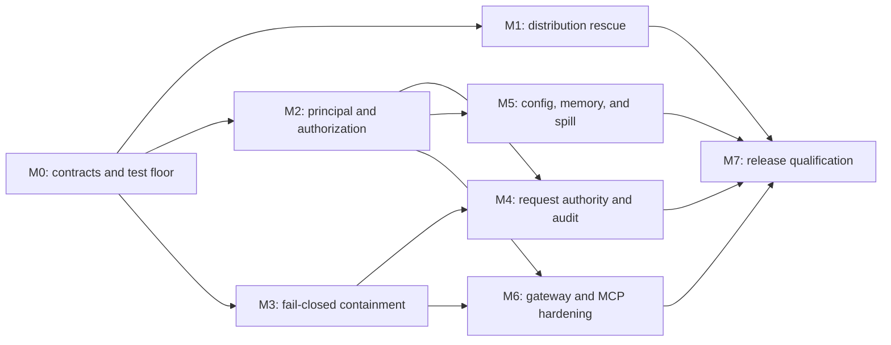

# AgentOS Audit Remediation Plan

Status: active  
Created: 2026-08-18  
Planning baseline: `main` at `224f070`  
Source: architecture, feature-completeness, security, operability, and verification audit completed on 2026-08-18

## 1. Purpose

This plan converts the 2026-08-18 audit into executable development work. It
supersedes the completion claims in the older roadmaps wherever the audit found
that a documented invariant, stable feature, or release contract is not enforced
end to end.

The objective is not to add more surface area. It is to make the current surface
truthful, fail-closed, testable, and releasable.

## 2. Audit baseline

The audit found a strong core implementation:

- The normal run path is centralized and extensively integration-tested.
- Approval remains a concrete core mechanism and guardrails remain separate.
- Pause/resume, turn limits, tool batches, jobs, projection, compaction, and
  session fork have meaningful regression coverage.
- Current crate dependencies obey the core/interface extension boundary.
- The main Tokio queues are bounded.
- Formatting, type checking, Clippy, catalog freshness, import-boundary checks,
  and public-crate semver checks passed.

It also found release-blocking contract gaps:

1. Release artifacts are not self-contained and install documentation disagrees
   with the installer.
2. Sandboxed tools can run in-process when no compatible isolation executor is
   configured.
3. Channel, session, memory, and approval identity is not strong enough to
   isolate agents, channels, conversations, and senders.
4. Subagent policy “narrowing” can turn parent `AskUser` or constrained rules
   into blanket child `Allow`.
5. Remote-channel authentication and the shipped tool policy are unsafe when
   combined with unrestricted interpreter arguments, inherited secrets, and
   unrestricted network reads.
6. Filesystem identifiers and workspace paths are not uniformly traversal- and
   symlink-safe.
7. Routing and compaction bypass the claimed single provider-request authority;
   important safety decisions are not durably reconstructible.
8. Several accepted config keys, especially memory policy and retention, are
   inert or overridden by another policy surface.
9. Spill recovery, provisional streaming, persistent semantic memory, and stdio
   MCP do not yet satisfy their advertised end-to-end contracts.
10. The supported macOS verification path is not green, and CI does not exercise
    package installation, the gateway pipeline, or real Seatbelt enforcement.

The audit ran against `75db88c`. Commit `224f070` subsequently removed the three
missing skills from `[resources.skills].enabled`. `REL-001` completes that
configuration repair by removing the same unavailable names from the general
subagent and packages every static workspace asset behind an archive smoke
test. Installer command behavior remains in `REL-002`.

## 3. Definition of done

AgentOS is ready for a release candidate when all of the following are true:

- A release archive can be installed into an empty temporary prefix and run an
  offline `builtin.echo` turn using only files contained in the archive.
- Every stable capability has a maturity label, supported-platform statement,
  security assumptions, documentation, and an end-to-end test.
- A non-`full_access` tool is kernel-isolated by a compatible executor or is
  rejected before its implementation runs.
- Session, memory, approval, `/clear`, task, and audit state cannot cross a typed
  principal boundary.
- For every possible tool call, effective child authority is no greater than
  effective parent authority unless a separately recorded delegation grant was
  explicitly authorized.
- Every provider request and safety-boundary decision is linked to a durable,
  reconstructible manifest or event.
- Stable config contains no silent unknown keys, conflicting policy authorities,
  or inert fields.
- Stable streaming does not expose output that the output policy later rejects.
- Linux and macOS required checks, package smoke tests, gateway tests, semver
  checks, and generated-artifact checks are green from the release commit.
- There are no unresolved Critical findings. A High finding requires a named
  owner, compensating control, expiry date, and explicit release approval.

## 4. Release scope policy

Use three maturity levels until the remediation is complete:

| Level | Meaning | Enablement rule |
|---|---|---|
| Stable | Supported security and recovery contract; package- and platform-tested | May be enabled in the shipped config |
| Preview | Implemented but with an explicit limitation or missing production contract | Disabled by default and requires an explicit preview flag |
| Deferred | Not part of the release commitment | Not exposed as a completed capability |

For the rescue release, keep typed loop execution, ticketed approval, projection,
compaction, SQLite memory, static MCP, jobs, TUI, and the tested gateway core in
scope. Until their milestones close, classify stdio MCP, provisional streaming,
real-vector memory, and remote-channel production guarantees as Preview.

Do not start folded todo/plan/goal state, dynamic plugins, or new orchestrator
extensions during the rescue work.

## 5. Dependency map



M1 can run in parallel with M2 and M3. M2 and M3 are the trust-boundary
critical path. M6 may be removed from the rescue-release critical path only if
stdio MCP and remote channels are explicitly shipped as Preview rather than
Stable.

Sizes are comparative planning units, not calendar promises: S is one focused
change, M is a coordinated multi-PR workstream, and L includes schema, protocol,
or migration work that must be staged.

## 6. Milestones

### M0 — Freeze contracts and establish the test floor

Priority: P0  
Size: S  
Status: in progress (`ADR-001` accepted, baseline recorded, and policy-narrowing plus fail-closed sandbox regressions landed under `TEST-001`)
Dependencies: none

Deliverables:

1. Add short architecture decisions covering:
   - strict policy narrowing versus an explicit delegation grant;
   - fail-closed sandbox behavior and isolation-executor compatibility;
   - the typed principal and its persistence key;
   - provider request kinds and mandatory manifests;
   - immutable safety-event types;
   - `/clear` epoch reset versus irreversible deletion;
   - stable buffered output versus provisional streaming.
2. Add a capability matrix with `stable`, `preview`, and `deferred` status,
   supported platforms, required config, security limitations, and test level.
3. Turn each P0/P1 audit finding into a failing regression test before changing
   implementation behavior.
4. Record the current benchmark, storage, startup, and gateway smoke baselines.

Baseline snapshot: [`AUDIT_BASELINE_2026-08-18.md`](AUDIT_BASELINE_2026-08-18.md).

Acceptance criteria:

- Every disputed invariant has one testable definition.
- Existing compatibility exceptions are named; none remain hidden in comments
  or weakened property tests.
- Experimental features cannot be mistaken for stable features in README,
  release notes, catalogs, or example config.
- The audit-to-work mapping in section 9 has an owner before implementation
  starts.

Primary files:

- `DESIGN.md`
- `docs/ARCHITECTURE.md`
- `docs/CONFIG_CATALOG.md`
- `docs/TOOL_CATALOG.md`
- new architecture compliance tests under `crates/agentos-core/tests/`

### M1 — Repair source, package, install, and platform contracts

Priority: P0  
Size: M  
Status: implementation complete; `REL-001`, `REL-002`, and `CI-001` await qualifying Linux/macOS CI runs
Dependencies: M0

Deliverables:

1. Package the complete runtime workspace: enabled skills, subagents,
   sub-orchestrator templates, example config, and every document linked from
   the packaged README or User Guide. **Implemented:** the archive copies only
   static workspace assets, the complete documentation tree, `DESIGN.md`, and
   `BENCHMARKS.md`; the artifact checker resolves their references.
2. Choose one install layout. Prefer the XDG paths already documented:
   `~/.local/bin/agentos` and `~/.local/share/agentos`. **Implemented:** these
   are the defaults; `XDG_DATA_HOME`, independent path overrides, and an
   explicit `--prefix` remain supported.
3. Expose diagnostics through the installed wrapper (`agentos config`) instead
   of requiring the private `agentos-gateway` binary on `PATH`.
   **Implemented:** the wrapper delegates to the bundled gateway diagnostic
   with its installed config and runtime paths.
4. Make `agentos resume` handle an omitted state path without a `set -u` failure.
   **Implemented:** it uses `workspace/runs/cli-run-1.json` and a missing file
   produces a deterministic typed error naming that path.
5. Replace the GNU-only `touch -d` test setup with a portable Rust mechanism.
   **Implemented:** the fixture uses `File::set_modified`.
6. Make spill golden fixtures independent of absolute temporary-path length.
   **Implemented:** golden temp paths have a fixed displayed width before
   request accounting and are redacted before comparison.
7. Probe actual Seatbelt profile application on macOS; presence of
   `/usr/bin/sandbox-exec` alone is not availability. **Implemented:** a cached
   permissive-profile and denied-write probe determines availability.
8. Add a clean-room source and release-artifact smoke job. **Implemented:** the
   Linux/macOS CI matrix tests the extracted archive directly, installs from
   both archive and source into isolated homes, checks wrapper diagnostics and
   resume behavior, and completes offline echo turns.

Acceptance criteria:

- From a clean checkout, runtime construction and one `builtin.echo` turn pass.
- A release archive installs to a temporary prefix and runs without repository
  files.
- Every enabled skill, routing target, subagent, and template resolves.
- `agentos config`, `agentos gateway-status`, and pathless `agentos resume` have
  deterministic behavior.
- Every packaged documentation link resolves.
- `cargo test --workspace --locked` and
  `cargo bench -p agentos-core --locked -- --test` pass on Linux and macOS.

Primary files:

- `scripts/package-release.sh`
- `scripts/install-agentos.sh`
- `scripts/start-agentos.sh`
- `.github/workflows/ci.yml`
- `crates/agentos-core/src/spill/mod.rs`
- `crates/agentos-core/src/sandbox/macos.rs`
- `crates/agentos-core/tests/transcripts_context.rs`

### M2 — Introduce principal identity and correct authorization

Priority: P0  
Size: L  
Status: in progress (`ID-001` typed principal/session ownership, `ID-002`
versioned migration, and `AUTH-001` remote authorization implemented;
`AUTH-002`/`AUTH-003` policy work remains)
Dependencies: M0 and a persistence schema-version mechanism

Deliverables:

1. Introduce a versioned principal/session key containing agent or tenant,
   channel, conversation, and sender where authorization requires sender
   identity. **Implemented:** `PrincipalKeyV1`, `SenderIdentity`, and
   epoch-bearing `SessionKey` are shared protocol types with canonical
   length-prefixed bytes and stable storage names.
2. Use the principal for sessions, memory scopes, approval tickets, `/clear`,
   jobs, task sessions, and audit events. **Implemented for session/run state,
   memory, `/clear`, jobs, task-session files, and trace files.** Approval
   resolver binding is implemented for initiators and configured same-chat
   administrators; durable safety-event identity remains `AUD-001`.
3. Replace lossy namespace encoding with injective encoding. **Implemented:**
   canonical principal/session bytes and arbitrary namespace/file components
   use unpadded base64url rather than replacement sanitization.
4. Bind approval resolution to the principal that received the prompt and, for
   group conversations, to the initiating sender or authorized administrators.
   **Implemented:** persistent and one-shot remote approval paths require the
   initiating `SessionKey`, except for explicitly configured administrators in
   the same channel and conversation.
5. Require a sender/chat allowlist for remote channels unless an explicit
   `allow_all_senders = true` compatibility option is present.
   **Implemented:** typed Telegram/Feishu sender, conversation, and
   administrator lists fail closed; unattributed events remain rejected even
   under the compatibility switch.
6. Implement true policy narrowing over exact actions and argument constraints.
   Parent `AskUser` remains `AskUser`; constrained parent `Allow` cannot become
   unconstrained child `Allow`.
7. If unattended delegation is required, model it as a separate, explicit,
   durable delegation grant rather than an exception inside `Policy::narrow`.
8. Replace the shipped blanket mutation allowlist with operation-level safe
   defaults.
9. Provide a dry-run migration report, collision detection, backup requirement,
   atomic migration, and restart-safe progress marker for legacy data.
   **Implemented:** `agentos-gateway migrate --dry-run` reports principal and
   namespace splits without mutation; apply requires a non-overwritten SQLite
   backup, quarantines unresolved rows, and advances version 1 atomically behind
   a prepared/completed restart marker.

Acceptance criteria:

- Property tests prove `child(call) <= parent(call)` for randomized rules,
  operations, and arguments.
- `telegram:42`, `feishu:42`, and another agent's `telegram:42` never share
  session or memory state.
- Two formerly colliding namespace components, such as `a/b` and `a_b`, remain
  distinct.
- A second group participant cannot approve or clear the initiator's state.
- Widening configurations fail at startup with actionable diagnostics.
- Legacy collisions are reported; records are never silently merged.

Primary files:

- `crates/agentos-proto/src/ids.rs`
- `crates/agentos-proto/src/envelope.rs`
- `crates/agentos-interfaces/src/session.rs`
- `crates/agentos-core/src/approve/mod.rs`
- `crates/agentos-core/src/memory/scope.rs`
- `crates/agentos-core/src/memory/authorize.rs`
- `crates/agentos-core/src/memory/sqlite.rs`
- `crates/agentos-core/src/runtime/tools_config.rs`
- gateway approval and shard modules

### M3 — Make containment fail closed

Priority: P0  
Size: L  
Status: in progress (`SBX-001` registry refusal and executor capability checks implemented; actual MCP server isolation and platform qualification remain)
Dependencies: M0; principal-sensitive ingress work also depends on M2

Deliverables:

1. Reject a sandboxed tool at registration or invocation when no compatible
   isolated executor exists. Its in-process implementation must never run.
   **Complete for registry invocation:** missing or incompatible executors are
   refused before the implementation body.
2. Define executor capabilities and typed errors for unavailable backends,
   unsupported tool protocols, and sandbox execution failure. **Complete for
   the bundled executor:** modes and `builtin_shell_v1` are advertised and all
   refusal/failure paths are typed.
3. Isolate the actual MCP server process rather than sending MCP calls through a
   shell-only worker.
4. Validate task IDs, subagent names, template names, attachment components, and
   every other filesystem-derived identifier as safe single path segments.
5. Replace lexical workspace containment with directory-relative, no-follow
   filesystem operations. Add symlink-race tests.
6. Remove interpreters such as `python3` from the generic default shell profile;
   use explicit command profiles with argument constraints for trusted skills.
7. Pass a minimal allowlisted environment to subprocesses and MCP servers;
   provider and channel credentials must not be inherited.
8. Terminate process groups, not only the direct child, at cancellation or
   deadline.
9. Add centralized egress policy: DNS/IP and redirect revalidation, private and
   metadata-address blocking, response streaming, and byte limits.
10. Bound attachment downloads, Feishu fragment counts, MCP frames, provider
    responses, and all preallocation decisions.

Acceptance criteria:

- A sandboxed mock tool's body is never invoked without a compatible backend.
  **Met by the registry and integration regressions.**
- Real Landlock and Seatbelt jobs exercise enforced read-only and
  workspace-write profiles; supported targets cannot treat a skip as success.
- Traversal, planted symlink, and symlink-race fixtures cannot escape the root.
- Canary secrets are absent from subprocess and MCP environments.
- Deadlines leave no descendant process.
- SSRF tests cover loopback, RFC1918, link-local, metadata endpoints, IPv6,
  redirects, and DNS rebinding.
- Oversized inputs and responses fail before unbounded allocation or storage.

Primary files:

- `crates/agentos-core/src/tools/registry.rs`
- `crates/agentos-core/src/bin/agentos-tool-worker.rs`
- `crates/agentos-core/src/tools/exec.rs`
- `crates/agentos-core/src/tools/builtin/common.rs`
- `crates/agentos-core/src/tools/builtin/http.rs`
- `crates/agentos-core/src/task_workspace.rs`
- `crates/agentos-core/src/tools/mcp.rs`
- channel attachment and long-connection modules

### M4 — Restore request authority, auditability, and state semantics

Priority: P1  
Size: M  
Status: planned  
Dependencies: M2 and M3

Deliverables:

1. Add one provider-call gateway used by planning, routing, compaction, and any
   future model request.
2. Give every request a kind, `RequestHeader`, usage record, trace link, and
   stable manifest of what the provider saw.
3. Add immutable safety events for approval requested/resolved/denied,
   guardrail trips, sandbox refusal, cancellation, and terminal errors.
4. Persist error-path state before returning from the runner. Redact or digest
   sensitive tool arguments rather than duplicating them into audit logs.
5. Replace pending-state deletion as the only record of a successful approval.
6. Define recoverable tool denial separately from fatal structural denial and
   update the state diagram and tests.
7. Make `/clear` create a new session epoch or tombstone. If irreversible purge
   is required, expose it as a distinct authorized operation.
8. Route cancellation and every other terminal reply through the declared
   output policy.
9. Default stable channels to buffered, guardrail-checked output. Keep
   provisional streaming opt-in until an incremental guardrail or safe staging
   interface exists.
10. Either introduce state-specific successor types/private constructors or
    revise the compile-time-transition claim and add an exhaustive transition
    table test.

Acceptance criteria:

- Exactly one manifest is recorded for every provider invocation, including
  routing and compaction; all usage reaches run totals.
- Replay can identify the inputs to every provider request.
- Approval and guardrail history survives pause, resume, restart, and error.
- Audit events do not expose raw secrets or unrestricted tool arguments.
- Normal `/clear` performs no session-item `DELETE`.
- A seeded output-policy violation emits zero user-visible bytes in stable mode.
- No direct provider call outside the gateway can be added without failing CI.

Primary files:

- `crates/agentos-core/src/prompt/`
- `crates/agentos-core/src/orchestrator/routing.rs`
- `crates/agentos-core/src/orchestrator/max.rs`
- `crates/agentos-core/src/loop/`
- `crates/agentos-core/src/runner.rs`
- `crates/agentos-interfaces/src/run_state.rs`

### M5 — Make config, memory, and spill behavior authoritative

Priority: P1  
Size: M  
Status: planned  
Dependencies: M0; memory authorization depends on M2

Deliverables:

1. Inventory every accepted key as effective, deprecated, or preview. Remove or
   wire every inert stable key.
2. Make `agent.id` reach runtime context, traces, sessions, and memory, or remove
   it. Deprecate the duplicate `agent.memory` key in favor of `[memory].backend`.
3. Make `[memory.policy]` the sole authority for read, write, forget, and shared
   writes. Reject conflicting coarse allowlist rules.
4. Wire `memory.default_domain`, shared-domain write flags, and record/age/byte
   retention into runtime behavior.
5. Apply `deny_unknown_fields` consistently or provide an equivalent complete
   unknown-key collector.
6. Make `resources.llm.enabled` and resource ordering observable, or remove the
   misleading fields.
7. Add an effective-config diagnostic showing resolved values, source, maturity,
   and conflicts.
8. Reduce undocumented stable config keys from 102 to zero.
9. Replace absolute spill paths exposed to the model with an opaque,
   owner-scoped locator and dedicated retrieval operation.
10. Add retention and quotas for sessions, traces, attachments, spill, gateway
    logs, jobs, and access records.

Acceptance criteria:

- A typo such as `max_reocrds` is a load-time error.
- Every stable config key has a behavioral assertion, not only a parse test.
- Memory writes and forgets produce the configured decision; a general tool
  allowlist cannot silently override it.
- Shared writes require global, domain, and caller permission.
- Changing the default domain changes writes and hydration.
- Count, age, and byte retention prune deterministic seeded data.
- A large tool result is recovered through the normal loop and registry with an
  opaque locator, including when spill storage is outside the workspace.
- A locator cannot read another run's spill or an arbitrary file.

Primary files:

- `crates/agentos-core/src/config/`
- `crates/agentos-core/src/runtime/`
- `crates/agentos-core/src/memory/`
- `crates/agentos-core/src/spill/mod.rs`
- `crates/agentos-core/src/tools/builtin/file.rs`
- generated catalogs and configuration documentation

### M6 — Harden gateway persistence and stdio MCP

Priority: P1 for stable remote channels; P2 if both remain Preview  
Size: L  
Status: planned  
Dependencies: M2 and M3

Deliverables:

1. Share one process-wide persistence authority across channels, or introduce a
   DB actor/blocking pool with an explicitly bounded concurrency model.
2. Enable SQLite WAL and a bounded busy timeout; elect one reflection and
   retention leader.
3. Add a durable, idempotent ingress ledger. Acknowledge channel events only
   after durable enqueue and suppress replayed side effects.
4. Enforce private permissions, atomic replacement, and required durability for
   session, task, approval, attachment, trace, and control state.
5. Replace unverified PID signaling with a locked PID record or authenticated
   control socket and implement graceful bounded drain.
6. Replace the reference stdio protocol with a pinned MCP protocol version:
   initialization, capability negotiation, paginated listing, standard content
   mapping, cancellation, structured errors, shutdown, and reconnect.
7. Bound MCP queues, frames, stderr capture, response sizes, and restart loops.
8. Add interoperability tests against an independent MCP fixture, not only the
   AgentOS echo worker.

Acceptance criteria:

- Multi-channel stress runs produce no cross-principal data, `SQLITE_BUSY`, or
  duplicate maintenance.
- Crash injection before/after durable enqueue and acknowledgment causes neither
  lost accepted messages nor duplicate committed side effects.
- Storage converges to configured limits and sensitive files remain private
  under a permissive process umask.
- SIGTERM drains within a documented deadline and reports abandoned work.
- MCP lifecycle tests cover startup, repeated calls, timeout, crash, restart,
  stderr, malformed frames, and graceful shutdown.
- A read-only MCP server demonstrably cannot write to the workspace.

Primary files:

- `crates/agentos-cli/src/bin/agentos-gateway/`
- `crates/agentos-core/src/gateway/`
- `crates/agentos-core/src/memory/sqlite.rs`
- `crates/agentos-core/src/tools/mcp.rs`
- `tests/gateway_pipeline.py`

### M7 — Make release qualification mandatory

Priority: P0 release gate  
Size: M  
Status: planned  
Dependencies: M1, M4, M5, and either M6 or explicit Preview classification

Deliverables:

1. Pin CI actions by commit SHA and use `--locked` for every Cargo command.
2. Require Linux and macOS jobs with real sandbox enforcement.
3. Run source startup, packaged install/start/stop, gateway pipeline, schema
   migration, and rollback rehearsals.
4. Make public-interface semver checks blocking for release branches.
5. Add dependency advisory, license, duplicate-dependency, and allowed-source
   policy with time-limited exceptions.
6. Add scheduled fuzz/property, fault-injection, Miri where practical, soak, and
   performance-regression jobs.
7. Produce checksums, SBOM, provenance, signed artifacts, and a release feature
   matrix generated from the release commit.
8. Stage rollout through internal soak, single-channel canary, multi-channel
   canary, limited cohort, and general availability.

Acceptance criteria:

- Required checks cannot be bypassed by an ordinary merge.
- The artifact, catalogs, capability matrix, and release notes describe the same
  feature surface.
- Upgrade, restart, rollback, and legacy-data migration have been rehearsed on
  representative data.
- No canary observes a principal-boundary violation, duplicate side effect,
  sandbox fallback, migration loss, unexplained storage growth, or leaked
  rejected output.
- Dashboards and alerts cover queue saturation, sandbox denial, approval
  failure, DB contention, retention backlog, process leaks, and delivery lag.

## 7. Pull-request slices

Keep changes independently reviewable. Do not combine persistence migrations,
policy semantics, and new features in one PR.

| Slice | Scope | Depends on |
|---|---|---|
| `ADR-001` | Resolve narrowing, sandbox, identity, request, audit, clear, and streaming contracts (**complete:** [`ADR-001`](adr/ADR-001-remediation-contracts.md)) | — |
| `TEST-001` | Add red tests for the P0/P1 audit findings (**in progress:** identity isolation, strict policy-narrowing, and no-body-invocation sandbox regressions landed) | ADR-001 |
| `REL-001` | Self-contained release workspace and documentation (**implemented:** complete static workspace/docs plus clean-room archive checker; qualifying CI run pending) | TEST-001 |
| `REL-002` | Installer/wrapper contract and clean-room smoke (**implemented:** XDG defaults, wrapper diagnostics, pathless resume, and Linux/macOS source/artifact install smoke; qualifying CI runs pending) | REL-001 |
| `CI-001` | Portable spill/golden tests and macOS sandbox probe (**in progress:** implementation and required Linux/macOS sandbox jobs added; qualifying CI run pending) | TEST-001 |
| `ID-001` | Typed principal and injective namespace (**implemented and locally verified:** principal-keyed sessions, memory, jobs, clear, task sessions, traces, and subagent forks) | ADR-001 |
| `ID-002` | Versioned persistence migration and collision report (**implemented and locally verified:** read-only report, mandatory backup, atomic rewrite, quarantine, crash/disk-full restart, rollback snapshot, and paused-state compatibility) | ID-001 |
| `AUTH-001` | Remote sender authentication and approval binding (**implemented and locally verified:** fail-closed sender/chat policy, unattributed-event rejection, initiator binding, and same-chat administrator override) | ID-001 |
| `AUTH-002` | Exact policy lattice and explicit delegation grants (**in progress:** strict lattice enforced; explicit grants pending) | ADR-001 |
| `AUTH-003` | Conservative shipped policy and command profiles | AUTH-002 |
| `SBX-001` | Fail-closed registry and executor capability protocol (**in progress:** registry fallback removed; actual MCP server protocol pending) | ADR-001 |
| `FS-001` | Validated path segments and no-follow containment | TEST-001 |
| `PROC-001` | Minimal tool environment and process-group termination | SBX-001 |
| `NET-001` | Egress policy and bounded HTTP | TEST-001 |
| `ING-001` | Attachment and frame limits | ID-001 |
| `REQ-001` | Unified provider-call gateway and request kinds | ADR-001 |
| `AUD-001` | Durable, redacted safety events | REQ-001, ID-001 |
| `STATE-001` | Clear epochs, denial semantics, terminal output gate | AUD-001 |
| `CFG-001` | Unknown-key rejection and effective-config inventory | ADR-001 |
| `MEM-001` | Effective memory policy, domains, shared writes, retention | ID-001, CFG-001 |
| `SPILL-001` | Opaque spill locator and scoped retrieval | FS-001 |
| `GW-001` | Durable ingress, WAL, maintenance leadership, shutdown | ID-002 |
| `MCP-001` | Standard lifecycle, bounds, interoperability, server isolation | SBX-001 |
| `CI-002` | Required platform, artifact, gateway, migration, and semver gates | prior slices |

Each implementation PR should include the failing test, implementation, focused
verification, documentation, and capability-matrix update in the same change.

## 8. Verification matrix

Run for every implementation PR:

```sh
cargo fmt --all -- --check
cargo check --workspace --locked
cargo clippy --workspace --locked -- -D warnings
cargo test --workspace --locked
bash scripts/check-import-boundaries.sh
bash scripts/check-module-size.sh
bash scripts/check-catalogs.sh
git diff --check
```

Additionally:

- Public `agentos-interfaces` or `agentos-proto` changes: blocking
  `cargo semver-checks` against the merge base.
- Config or built-in `ToolSpec` changes: regenerate catalogs and run effective
  behavior tests.
- Policy changes: property tests plus parent/child, operation, argument, and
  approval-resume matrices.
- Persistence changes: migration, collision, crash, restart, rollback, and
  disk-full tests.
- Sandbox/process changes: real Linux Landlock and macOS Seatbelt jobs plus
  descendant cleanup tests.
- Channel changes: gateway pipeline, authentication, attachment, replay, and
  approval-principal tests.
- Release changes: package, install to a temporary prefix, offline turn,
  gateway start/status/stop, link validation, and uninstall cleanup.
- Provider-request changes: golden manifests and token/usage accounting.
- Hot-path changes: `cargo bench -p agentos-core --locked -- --test` and the
  relevant benchmark comparison.

## 9. Audit-to-work mapping

| Audit finding | Priority | Milestone | Owner role | Initial disposition |
|---|---:|---|---|---|
| Missing configured skills | P0 | M1 | Release engineering | Resolved by `REL-001`; archive smoke validates parent and subagent skill references |
| Release archive omits workspace assets | P0 | M1 | Release engineering | Resolved by `REL-001`; required CI artifact run pending |
| Installer/docs/wrapper mismatch | P1 | M1 | CLI/release | Resolved by `REL-002`; required CI matrix runs pending |
| Remote ingress plus permissive tool defaults | P0 | M2, M3 | Gateway security | Remote ingress resolved by `AUTH-001`; permissive shipped tool defaults remain `AUTH-003` |
| Cross-channel/session/sender identity collision | P0 | M2 | Identity/persistence | Resolved by `ID-001` and `ID-002`; legacy splits are reported and ambiguous rows quarantined |
| Policy narrowing widens authority | P0 | M2 | Core authorization | Strict per-call narrowing implemented and property-tested; explicit grant model pending |
| Sandboxed tool fallback/incompatible worker | P0 | M3 | Core sandbox | Registry fallback resolved with typed capability checks; actual MCP server isolation and platform qualification remain |
| Task/path traversal and symlink escape | P1 | M3 | Core filesystem | Open |
| SSRF, inherited secrets, process descendants, unbounded ingress | P1 | M3 | Tool security | Open |
| Routing/compaction bypass request authority | P1 | M4 | Prompt/orchestration | Open |
| Safety events not durably reconstructible | P1 | M4 | Run loop/observability | Open |
| Append-only, transition, denial, cancellation, streaming contract gaps | P1 | M4 | Run loop/session | Open |
| Inert/conflicting config and memory policy | P1 | M5 | Config/memory | Open |
| Retention and default domain not wired | P1 | M5 | Memory | Open |
| Spill locator not retrievable through declared tool | P1 | M5 | Prompt/tools | Open |
| Multi-runtime SQLite contention and duplicate maintenance | P1 | M6 | Gateway/persistence | Open |
| stdio MCP lifecycle and capacity gaps | P1/P2 | M6 | Tool integrations | Open; Preview until closed |
| macOS, package, gateway, semver, supply-chain CI gaps | P0 release gate | M1, M7 | Release engineering | Open |

## 10. Explicit deferrals

The following are not release-rescue dependencies:

- Folded todo/plan/goal state (`TRANSFER_ROADMAP.md` X7).
- Link-time extension registration while only one external extension needs it.
- Dynamic plugin loading and orchestrator extension crates.
- An explicit `job_start` plan variant.
- Feishu card approvals without a recorded live-tenant fixture.
- Real-vector retrieval as the default until persistence, backfill, restart, and
  paraphrase-quality tests pass.
- Production stdio MCP claims until M6 is complete.
- New channel integrations before principal, containment, and durable-ingress
  work is complete.

## 11. Risk register

| Risk | Mitigation |
|---|---|
| True narrowing increases approval prompts or breaks existing subagents | Provide startup diagnostics, an explicit grant model, and migration notes; never preserve silent widening |
| Principal migration finds ambiguous legacy records | Dry-run report, mandatory backup, collision quarantine, atomic/resumable migration |
| Strict containment breaks scripts or MCP servers | Compatibility profiles may be explicit, scoped, and temporary; never silently execute unsandboxed |
| XDG path correction strands existing installs | Detect the legacy path, provide a one-time migration command, and keep rollback metadata |
| Provider gateway changes goldens and usage totals | Land request-kind schema first, update goldens deliberately, preserve performance baselines |
| Durable audit events grow storage or capture sensitive data | Stable redacted schema, digests for arguments, configured retention, and privacy tests |
| SSRF policy blocks legitimate local services | Require explicit per-deployment egress exceptions with resolved-IP validation and diagnostics |
| Buffered stable output increases perceived latency | Keep preview streaming opt-in while designing incremental guardrails; measure first-token and final latency |
| Durable channel acknowledgment increases ingress latency | Track enqueue/ACK latency, bound queues, and canary before broader rollout |
| CI expansion increases cost and merge time | Keep a complete required merge floor; move fuzz, soak, Miri, and deep fault injection to scheduled jobs |

## 12. Planning cadence

- Review this document at the end of every milestone.
- Update the audit-to-work mapping only when an acceptance test demonstrates
  closure; code presence alone is insufficient.
- Keep one milestone `in progress` on the critical path. Parallel work is
  allowed only where the dependency map permits it.
- Re-run the clean-room artifact test before changing a feature from Preview to
  Stable.
- At release-candidate cut, reconcile this plan with `ARCHITECTURE.md`, README,
  User Guide, release notes, and both generated catalogs.
